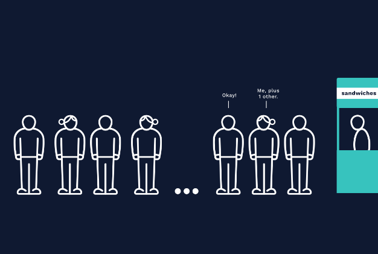

<h1>RECURSÃO: CONCEITUAL</h1>

<h2>Caso Base e Etapa Recursiva</h2>

A recursão tem dois aspectos fundamentais: o caso base e a etapa recursiva.

Ao usar a iteração, contamos com uma variável de contagem e uma condição booleana. Por exemplo, ao iterar pelos valores de uma lista, incrementaríamos a variável de contagem até que ela excedesse o comprimento do conjunto de dados.

As funções recursivas têm um conceito semelhante, que chamamos de caso base. O caso base determina se a função será recursiva ou se chamará a si mesma. Sem um caso base, é o equivalente iterativo a escrever um loop infinito.

Como estamos usando uma pilha de chamadas para rastrear as chamadas de função, seu computador gerará um erro devido a um estouro de pilha se o caso base não for suficiente.

O outro aspecto fundamental de uma função recursiva é a etapa recursiva. Esta parte da função é o passo que nos aproxima do caso base.

Em uma função iterativa, isso é tratado por uma construção de loop que diminui ou aumenta a variável de contagem que move o contador para mais perto de uma condição booleana, encerrando o loop.

Em uma função recursiva, o equivalente à “variável de contagem” é o argumento para a chamada recursiva. Se estivermos em contagem regressiva até 0, por exemplo, nosso caso base seria a chamada de função que recebe 0como argumento. Poderíamos projetar uma etapa recursiva que pega o argumento passado, o decrementa em um e chama a função novamente com o argumento decrementado. Dessa forma, estaríamos avançando em direção 0ao nosso caso base.

Analisar o tempo de execução Big O de uma função recursiva é muito semelhante a analisar uma função iterativa. Substitua iterações de um loop por chamadas recursivas.

Por exemplo, se fizermos um loop uma vez para cada elemento que imprime o valor, teremos um O(N)tempo de execução linear ou linear. Da mesma forma, se tivermos uma única chamada recursiva para cada elemento na chamada de função original, teremos um O(N)tempo de execução linear ou.

Instruções
Como a iteração e a recursão são semelhantes? Como eles são diferentes?

Podemos reescrever qualquer função iterativa de forma recursiva? Por que ou por que não
