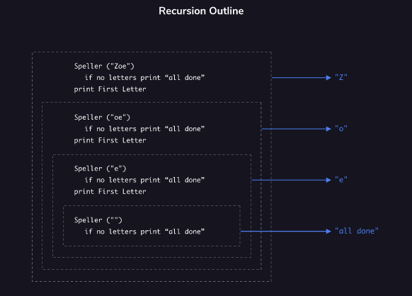

<h1>RECURSÃO: CONCEITUAL</h1>

<h2>Esboço de recursão</h2>

A recursão é uma estratégia para resolver problemas definindo o problema em termos de si mesmo. Por exemplo, para somar os elementos de uma lista pegaríamos o primeiro elemento e o adicionaríamos à soma dos elementos restantes .

Como obteríamos essa soma dos elementos restantes? Fácil! Pegaríamos o primeiro elemento dos elementos restantes e o adicionaríamos ao… Talvez você possa entender por que a recursão pode ser um assunto complicado!

Na programação, recursão significa que uma definição de função incluirá uma invocação da função dentro de seu próprio corpo. Aqui está um exemplo de pseudocódigo:

Se invocarmos esta função com “Zoe” como argumento, veríamos “Z”, “o” e “e” impressos antes de “tudo pronto”.

Chamamos a função um total de 4 vezes!

função chamada com “Zoe”
função chamada com “oe”
função chamada com “e”
função chamada com “”
Vamos dividir a função em três partes:

Esta seção é o caso base . NÃO estamos invocando a função sob esta condição. O caso base equivalente do exercício anterior foi quando atingimos o início da fila.

Esta seção resolve parte do problema. Se quisermos soletrar o nome de alguém, teremos que soletrar pelo menos uma letra

Esta seção é a etapa recursiva , chamando a função com argumentos que nos aproximam do caso base. Neste exemplo, estamos reduzindo o comprimento do nome em uma única letra. Eventualmente, haverá uma chamada de função sem letras fornecidas como argumento.

Para efeito de comparação, aqui está o pseudocódigo para uma abordagem iterativa para o mesmo problema:

Instruções
Compare as duas funções de pseudocódigo.

Como eles são diferentes? Quais partes são semelhantes?

Como é possível que uma função seja resolvida se ela se refere a si mesma?

