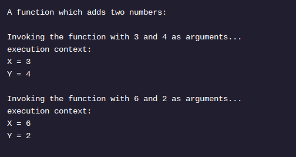
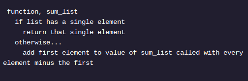

<h1>RECURSÃO: CONCEITUAL</h1>

<h2>Pilhas de chamadas e quadros de execução</h2>

Uma abordagem recursiva requer que a função se invoque com argumentos diferentes. Como o computador controla os vários argumentos e diferentes invocações de função se for a mesma definição de função?

Invocar funções repetidamente pode ser familiar quando ocorre sequencialmente, mas pode ser chocante ver essa invocação ocorrer dentro de uma definição de função .

As linguagens tornam isso possível com pilhas de chamadas e contextos de execução .

As pilhas, uma estrutura de dados, seguem um protocolo rígido para os dados do pedido que entram e saem da estrutura: a última coisa a entrar é a primeira a sair .

Sua linguagem de programação geralmente gerencia a pilha de chamadas , que existe fora de qualquer função específica. Essa pilha de chamadas rastreia a ordem das diferentes invocações de função, portanto, a última função a entrar na pilha de chamadas é a primeira função a sair da pilha de chamadas .

Podemos pensar nos contextos de execução como os valores específicos que inserimos em uma chamada de função.

Considere uma função de pseudocódigo que soma os inteiros em um array:

Esta função será invocada quantas vezes houver elementos na lista! Vamos passar:

CALL STACK EMPTY
___________________

Our first function call...
sum_list([5, 6, 7])

CALL STACK CONTAINS
___________________
sum_list([5, 6, 7])
with the execution context of a list being [5, 6, 7]
___________________

Base case, a list of one element not met.
We invoke sum_list with the list of [6, 7]...

CALL STACK CONTAINS
___________________
sum_list([6, 7])
with the execution context of a list being [6, 7]
___________________
sum_list([5, 6, 7])
with the execution context of a list being [5, 6, 7]
___________________

Base case, a list of one element not met.
We invoke sum_list with the list of [7]...

CALL STACK CONTAINS
___________________
sum_list([7])
with the execution context of a list being [7]
___________________
sum_list([6, 7])
with the execution context of a list being [6, 7]
___________________
sum_list([5, 6, 7])
with the execution context of a list being [5, 6, 7]
___________________

We've reached our base case! List is one element. 
We return that one element.
This return value does two things:

1) "pops" sum_list([7]) from CALL STACK.
2) provides a return value for sum_list([6, 7])

----------------
CALL STACK CONTAINS
___________________
sum_list([6, 7])
with the execution context of a list being [6, 7]
RETURN VALUE = 7
___________________
sum_list([5, 6, 7])
with the execution context of a list being [5, 6, 7]
___________________

sum_list([6, 7]) waits for the return value of sum_list([7]), which it just received. 

sum_list([6, 7]) has resolved and "popped" from the call stack...

----------------
CALL STACK contains
___________________
sum_list([5, 6, 7])
with the execution context of a list being [5, 6, 7]
RETURN VALUE = 6 + 7
___________________

sum_list([5, 6, 7]) waits for the return value of sum_list([6, 7]), which it just received. 
sum_list([5, 6, 7]) has resolved and "popped" from the call stack.

----------------
CALL STACK is empty
___________________
RETURN VALUE = (5 + 6 + 7) = 18

Instruções
Quando uma função recursiva entra no caso base sem nenhuma chamada recursiva, a pilha de chamadas estará vazia?

Por que ou por que não?

