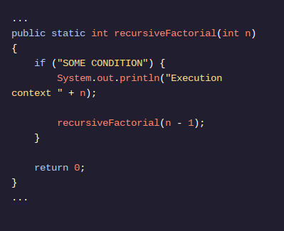
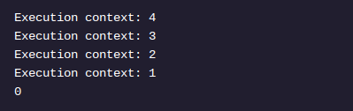

<h2>RECURSÃO EM JAVA</h2>

<h2>Recursão</h2>

<h2>Então, o que é recursão?</h2>

A recursão é uma abordagem computacional em que um método chama a si mesmo de dentro de seu corpo. Os programadores usam a recursão quando precisam executar a mesma ação várias vezes seguidas até atingir um ponto de parada predefinido, também conhecido como caso base .

Vamos pensar sobre isso no contexto do nosso exemplo fatorial. Abaixo está o início de uma implementação recursiva de fatorial. Este código está em Factorial.java , à direita.

Dentro do recursiveFactorial()método, verificamos se uma condição foi atendida. Se for, imprimimos o valor ne retornamos uma chamada para recursiveFactorial(n - 1). Se a condição não for atendida, retornamos 0.

Você consegue pensar em uma condição que resultará na seguinte resposta quando ligarmos recursiveFactorial(4)?

Queremos uma condição que deixe de ser verdadeira depois nde ser menor que 1, então a resposta correta é n > 0ou n >= 1. Neste ponto, temos o início de um método recursivo, mas ainda não estamos retornando nada significativo.

Instruções
Ponto de verificação 1 ativado
1 .
Remova a string dentro da ifinstrução. Substitua-o por algo que impedirá recursiveFactorial()a chamada de si mesmo se nfor menor que 1.
