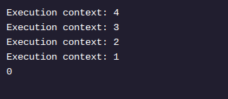

<h1>RECURSÃO EM JAVA</h1>

<h2>Caso Recursivo</h2>

No último exercício, você criou uma condição ( n > 0ou n >= 1). Esta condição é importante porque define se chama ou não recursiveFactorial()a si mesmo. Chamamos esse ifbloco de caso recursivo .

Na recursão, o caso recursivo é a condição sob a qual um método chama a si mesmo. Chamamos isso de caso recursivo porque, conforme mencionado no último exercício, a recursão é definida como: um processo que inclui um método que chama a si mesmo.

No final do último exercício, sua saída deveria ser semelhante a:

Neste ponto, ainda faltam alguns componentes do nosso método recursivo:

Calculando o produto de cada número – embora a implementação atual acesse todos os números que precisamos multiplicar, não calculamos seu produto.
recursiveFactorial()sempre retorna 0– o valor definido como recursiveSolution(veja Factorial.java à direita) é zero, porque sempre retornamos 0após o ifbloco em recursiveFactorial().
Instruções
Ponto de verificação 1 ativado
1 .
Dentro do ifbloco, devolva o produto de ne sua ligação para recursiveFactorial().

Depois de executar seu código, você verá que o valor salvo recursiveSolutionainda é 0. Por que não retornou os valores do produto de n * recursiveFactorial(n - 1)?
