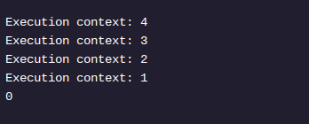
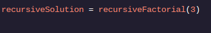

<h1>RECURSÃO EM JAVA</h1>

<h2>Caso base</h2>

Apesar de retornar uma chamada para n * recursiveFacorial(n - 1), a solução do último exercício não alterou a saída:

Por que o valor retornado não é igual ao produto nem cada contexto de execução? A resposta curta: não definimos um caso base . Para entender a necessidade de um caso base, vale a pena discutir a pilha de chamadas que Java cria quando você chamarecursiveFactorial() .

Se você ligasse:

Java criaria uma pilha de chamadas com os seguintes eventos:

recursiveFactorial(3)=3 * recursiveFactorial(2)
recursiveFactorial(2)=2 * recursiveFactorial(1)
recursiveFactorial(1)=1 * recursiveFactorial(0)
O valor de retorno associado a cada chamada de método depende do valor retornado pelo n - 1contexto. Você se lembra do que nosso método retorna quando né igual a0 ?

Como nossa implementação atual retorna 0quando né zero, cada produto na pilha de chamadas acima, começando com o evento 3, será multiplicado por 0. Isso leva a uma0 solução para cada um dos contextos acima.

Podemos consertar isso com um caso base . Quando o caso base for atendido ( n == 0), o método fatorial deverá retornar um número. Dica: o número não deve ser zero.

Instruções
Ponto de verificação 1 Envio
1 .
Mencionamos anteriormente que 0!é igual a 1, então nosso caso base é 0!. Quando esta condição for atendida, a função deverá retornar1 .

Remover return 0derecursiveFactorial() .

Adicione um elsebloco que retorne 1quando nnão for maior que 0.
