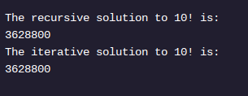

<h1>RECURSÃO EM JAVA</h1>

<h2>Análise</h2>

Ao longo desta lição, você aprendeu sobre recursão ao codificar um método fatorial. Embora cada problema recursivo seja um pouco diferente, os seguintes recursos sempre serão necessários:

Caso recursivo – as condições sob as quais o método executará uma ação e chamará a si mesmo.
Caso base – as condições sob as quais o método retorna um valor sem fazer nenhuma chamada adicional para si mesmo.
Neste exemplo, começamos considerando o caso recursivo. Com alguns problemas, pode ser mais fácil começar com o caso base. Independentemente disso, quando você estiver lidando com um problema recursivo, comece pensando em possíveis casos recursivos e base para sua solução.

Em Factorial.java , à direita, incluímos as soluções iterativas e recursivas para fatorial. Ambas as abordagens funcionam igualmente bem para este problema.

À medida que você aprende mais sobre recursão, você pode achar que a sintaxe recursiva é mais legível e mais fácil de entender ao resolver determinados problemas. Considere-o como mais uma ferramenta em sua caixa de ferramentas à medida que você aborda problemas de programação cada vez mais desafiadores.

Instruções
Ponto de verificação 1 aprovado
1 .
Altere o método main para que o programa imprima o seguinte:

Certifique-se de alterar o valor do argumento passado para cada método e o número na string registrada.
