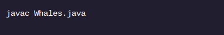
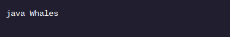
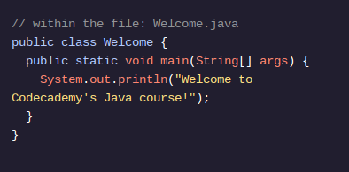
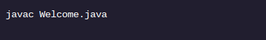
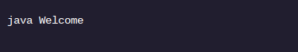
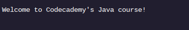

<h1>OLÁ MUNDO</h1>

<h2>Compilação: Criando Executáveis</h2>

A compilação nos ajudou a detectar um erro. Agora que corrigimos o arquivo, vamos fazer uma compilação bem-sucedida.

Como lembrete, podemos compilar um arquivo .java do terminal com o comando:

Se o arquivo for compilado com êxito, este comando produzirá uma classe executável : FileName.class . Executável significa que podemos executar este programa a partir do terminal.

Executamos o executável com o comando:

Observe que deixamos de fora a parte .class do nome do arquivo.

Aqui está um ciclo completo de compilação como exemplo:

Temos um arquivo: Welcome.java . Compilamos com o comando:

O terminal não mostra erros , o que indica uma compilação bem-sucedida.

Agora temos dois arquivos:

Welcome.java , nosso arquivo original com sintaxe Java.

Welcome.class , nosso arquivo compilado com bytecode Java, pronto para ser executado pela Java Virtual Machine.

Podemos executar a classe compilada com o comando:

O seguinte é impresso na tela

<h1>Instruções</h1>

Ponto de verificação 1 ativado
1 .
Vamos compilar e executar nosso programa!

Execute o lscomando no terminal para ver o arquivo .java não compilado .

Pressione o Check Workbotão depois de terminar cada ponto de verificação.
