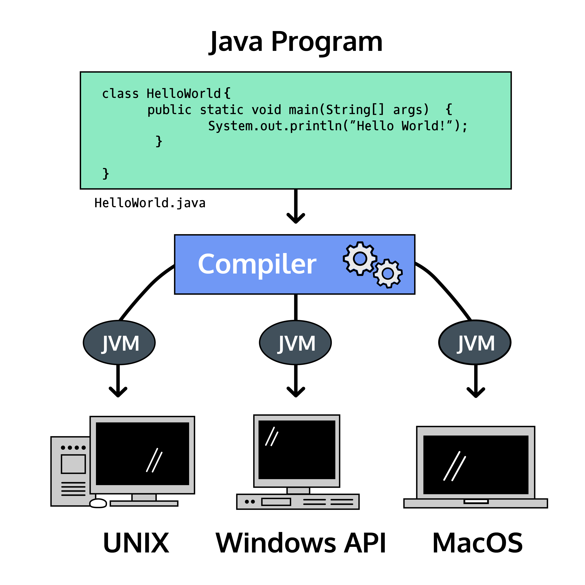
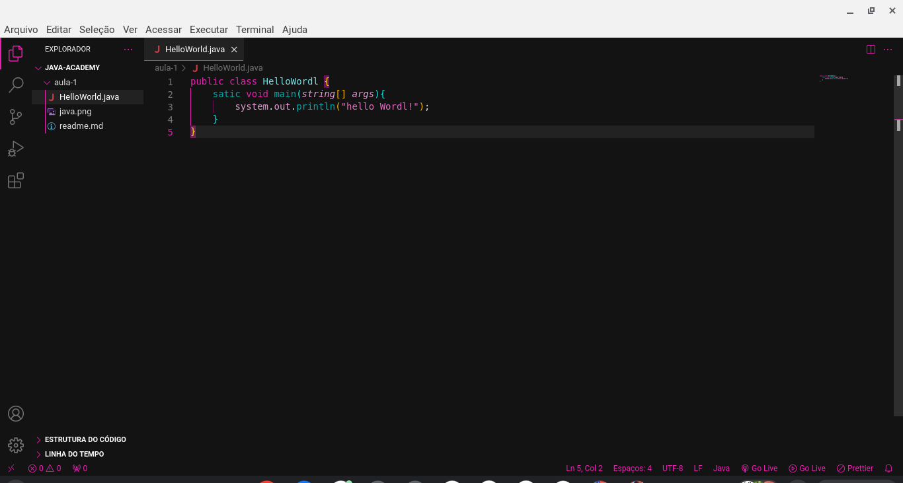

<h1>OLÁ MUNDO</h1>

<h2>Introdução ao Java</h2>

Bem-vindo ao mundo da programação Java!

As linguagens de programação permitem que os humanos escrevam instruções que um computador pode executar. Com instruções precisas, os computadores coordenam aplicações e sistemas que comandam o mundo moderno

A Sun Microsystems lançou a linguagem de programação Java em 1995. Java é conhecido por ser simples, portátil, seguro e robusto. Embora tenha sido lançado há mais de vinte anos, Java continua sendo uma das linguagens de programação mais populares da atualidade.

Um dos motivos pelos quais as pessoas adoram Java é a Java Virtual Machine, que garante que o mesmo código Java possa ser executado em diferentes sistemas operacionais e plataformas. O slogan da Sun Microsystems para Java era “escreva uma vez, execute em qualquer lugar”.

As linguagens de programação são compostas de sintaxe , as instruções específicas que Java entende. Escrevemos sintaxe em arquivos para criar programas , que são executados pelo computador para realizar a tarefa desejada

Vamos começar com a saudação universal para uma linguagem de programação. Exploraremos a sintaxe no próximo exercício.

