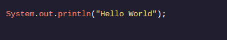
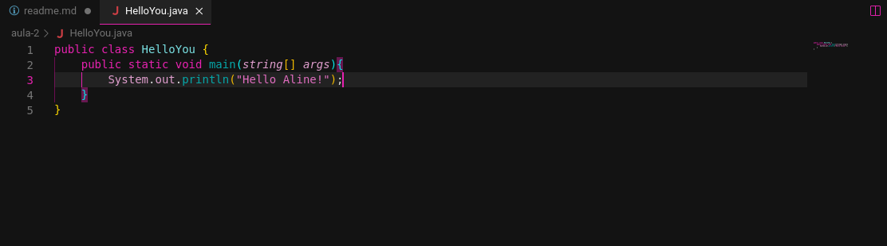

<h1>OLÁ MUNDO</>

<h2>Olá arquivo Java!</h2>

Java é executado em plataformas diferentes, mas os programadores o escrevem da mesma maneira. Vamos explorar algumas regras para escrever Java.

No último exercício, vimos o arquivo HelloWorld.java. Os arquivos Java possuem uma extensão .java . Alguns programas são um arquivo, outros são centenas de arquivos!

Lá dentro HelloWorld.java, tivemos uma aula :

Falaremos mais sobre aulas no futuro, mas por enquanto pense nelas como um conceito único .

O HelloWorldconceito é: Hello World Printer. Outros conceitos de classe poderiam ser: Bicicleta ou: Conta Poupança.

Marcamos o domínio deste conceito usando chaves: {}. A sintaxe entre chaves faz parte da classe.

Cada arquivo possui uma classe primária com o nome do arquivo. Nosso nome de classe: HelloWorlde nosso nome de arquivo: HelloWorld . Cada palavra é maiúscula.

Dentro da classe tínhamos um main() método que lista as tarefas do nosso programa:

Assim como as classes, usamos chaves para marcar o início e o fim de um método.

public, static, e voidsão sintaxes que aprenderemos em lições futuras. String[] argsé um espaço reservado para informações que queremos passar para nosso programa. Esta sintaxe é necessária para a execução do programa, mas é mais avançada do que precisamos explorar no momento.

Nosso programa também exibiu o texto "Hello World"na tela. Isso foi feito usando uma instrução print:

Aprenderemos mais sobre instruções impressas no próximo exercício!

<h3>Instruções</h3>

Ponto de verificação 1 aprovado

1 .

O editor de texto possui um arquivo, HelloYou.java, que contém uma HelloYouclasse com um main()método.

Dentro main(), adicione uma declaração que imprime Hello someName!, com seu nome substituindo someName. Certifique-se de terminar a instrução com ponto e vírgula.

Por exemplo, se o seu nome fosse “Maria”, o programa imprimiria Hello Maria!.

<h3>Minha resolução</h3>

