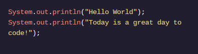
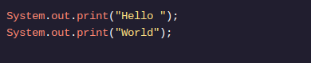

<h1>OLÁ MUNDO</h1>

<h2>Imprimir extratos</h2>

Vamos dar uma olhada mais de perto nesta instrução do nosso programa anterior:

As instruções de impressão geram informações de saída na tela (também chamada de terminal de saída ). Vamos detalhar um pouco mais essa linha de código. Não se preocupe se alguns dos termos aqui forem novos para você. Iremos nos aprofundar no que tudo isso é com muito mais detalhes posteriormente!

Systemé uma classe Java integrada que contém ferramentas úteis para nossos programas.

out é a abreviatura de “saída”.
printlné a abreviatura de “linha de impressão”.

Podemos usar System.out.println()sempre que quisermos que o programa crie uma nova linha na tela após gerar um valor:

Depois "Hello World"de impresso, o terminal de saída cria uma nova linha para a próxima instrução a ser emitida. Este programa imprimirá cada instrução em uma nova linha assim:

Também podemos gerar informações usando System.out.print(). Observe que estamos usando print(), não println(). Ao contrário System.out.println(), esse tipo de instrução print gera tudo na mesma linha. Por exemplo:

O código acima terá a seguinte saída:

Neste exemplo, se você usar print()ou println()novamente, o novo texto será impresso imediatamente após Worldna mesma linha. É importante lembrar onde você deixou o “cursor” do seu programa. Se você usar println()o cursor será movido para a próxima linha. Se você usar print()o cursor permanece na mesma linha.

Observação: daqui para frente, após este exercício, todos os exercícios serão usados System.out.println()​​para gerar valores. No entanto , você praticará o uso System.out.print()de declarações nos pontos de verificação abaixo.

<h2>Instruções</h2>

1 .
Dentro main()e abaixo da instrução print System.out.println("Let's play hide and seek.");, produza as duas instruções a seguir usando System.out.print():

"Three..."
"Two..."

