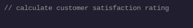
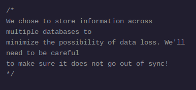
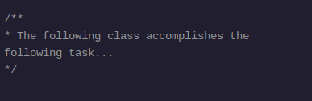
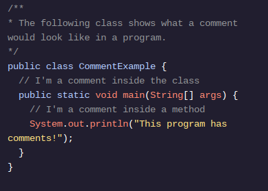

<h1>OLÁ MUNDO</h1>

<h2>Código de comentários</h2>

Escrever código é um processo emocionante de instruir o computador a realizar tarefas fantásticas.

O código também é lido pelas pessoas e queremos que as nossas intenções sejam claras para os humanos, tal como queremos que as nossas instruções sejam claras para o computador.

Felizmente, não estamos limitados a escrever sintaxe que execute uma tarefa. Também podemos escrever comentários , notas para leitores humanos do nosso código. Esses comentários não são executados, portanto não há necessidade de sintaxe válida em um comentário.</p.>

Quando os comentários são curtos, usamos a sintaxe de linha única: //.

Quando os comentários são longos, usamos a sintaxe multilinha: /*e */. 

Outro tipo de opção de comentário é o comentário Javadoc, representado por /**e */. Comentários Javadoc são usados ​​para criar documentação para APIs (Interfaces de Programação de Aplicativos). Ao escrever comentários Javadoc, lembre-se de que eles serão eventualmente usados ​​na documentação que seus usuários poderão ler, portanto, seja especialmente cuidadoso ao escrever esses comentários.

Os comentários Javadoc são normalmente escritos antes da declaração de campos, métodos e classes (que abordaremos mais adiante neste curso):

Veja como ficaria um comentário em um programa completo:

Os comentários são diferentes da impressão na tela, quando usamos System.out.println(). Esses comentários não aparecerão em nosso terminal, são apenas para quem lê nosso código no editor de texto.

<h1>Instruções</h1>

Ponto de verificação 1 aprovado
1 .
O arquivo Timeline.javacontém informações de texto simples sobre Java.

Fatos de texto simples não são sintaxe válida. Usaremos comentários para evitar quebrar o programa.

Use a sintaxe de comentário de linha única para o primeiro fato.

Transforme esta linha em um comentário:

Sun Microsystems announced the release of Java in 1995
