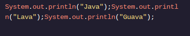
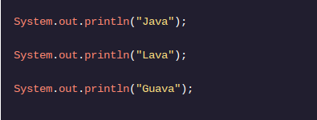

<h1>OLÁ MUNDO</h1>

<h2>Ponto e vírgula e espaço em branco</h2>

Como vimos nos comentários , ler código é tão importante quanto escrever código.

Devemos escrever um código que seja fácil de ser lido por outras pessoas. Essas pessoas podem ser colegas de trabalho, amigos ou até você mesmo!

Java não interpreta espaços em branco , as áreas do código sem sintaxe, mas humanos usam espaços em branco para ler código sem dificuldade.

Funcionalmente, esses dois exemplos de código são idênticos:

Eles imprimirão o mesmo texto na tela, mas qual você prefere ler? Imagine se fossem centenas de instruções! Espaço em branco seria essencial.

Java interpreta ponto e vírgula. Ponto e vírgula são usados ​​para marcar o final de uma instrução , uma linha de código que executa uma única tarefa.

As únicas declarações que vimos até agora são System.out.println("My message!");.

Vamos contrastar as declarações com as chaves, {}. Chaves marcam o escopo de nossas classes e métodos. Não há ponto e vírgula no final de uma chave.classes e métodos . Não há ponto e vírgula no final de uma chave.

<h1>Instruções</h1>

Ponto de verificação 1 ativado
1 .
O LanguageFacts.javaarquivo imprime informações sobre Java na tela.

Infelizmente, o autor do arquivo evitou usar espaços em branco.

Torne o arquivo mais fácil de ler adicionando uma nova linha após cada instrução!
