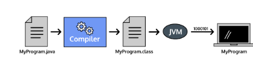
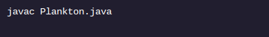
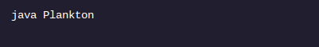

<h1>OLÁ MUNDO</h1>

<h2>Compilação: captura de erros</h2>

Java é uma linguagem de programação compilada , o que significa que o código que escrevemos em um arquivo .java é transformado em código de bytes por um compilador antes de ser executado pela Java Virtual Machine em seu computador.

Os exercícios anteriores compilaram e executaram automaticamente os arquivos para você. Ambientes de desenvolvimento fora da plataforma também podem compilar e executar arquivos para você, mas é importante entender esse aspecto do desenvolvimento Java, por isso faremos isso sozinhos.

O processo de compilação detecta erros antes que o computador execute nosso código.

O compilador Java executa uma série de verificações enquanto transforma o código. O código que não passar nessas verificações não será compilado.

Este exercício usará um terminal interativo. Codecademy tem uma lição sobre linha de comando se você quiser saber mais.

Por exemplo, com um arquivo chamado Plankton.java, poderíamos compilá-lo com o comando do terminal:

Uma compilação bem-sucedida produz um arquivo .classPlankton.class : , que executamos com o comando do terminal:

Uma compilação malsucedida produz uma lista de erros . Nenhum arquivo .class é criado até que os erros sejam corrigidos e o comando de compilação seja executado novamente.

<h1>Instruções</h1>

Ponto de verificação 1 ativado
1 .
Vamos praticar a compilação e execução de um arquivo inserindo comandos no terminal!

Nosso editor de texto contém um programa quebrado para que possamos ver como os compiladores nos ajudam a detectar erros. Não faça nenhuma correção!

No terminal, digite este comando: javac Compiling.javae pressione enterou return. Você verá uma mensagem de erro, mas não se preocupe, resolveremos isso na próxima etapa.

Clique no Check Workbotão para verificar seu trabalho e passar para o próximo ponto de verificação.
