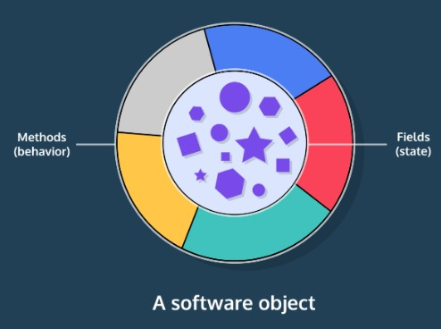
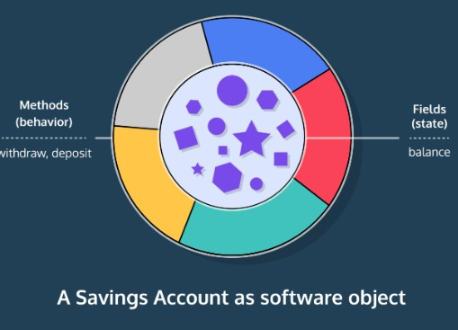

<h1>INTRODUÇÃO ÀS CLASSES</h1>

<h2>Introdução às Aulas</h2>

Todos os programas requerem um ou mais Classes que funcionam como um modelo para o mundo.

Por exemplo, um programa para acompanhar as pontuações dos testes dos alunos pode ter , e classes. Nossas preocupações do mundo real, os alunos e suas notas, estão dentro do programa como aulas. StudentCourseGrade

Representamos cada aluno como uma instância, ou objeto, da classe.Student

Isso é programação orientada a objetos porque os programas são construídos em torno de objetos e suas interações. Um objeto contém estado e comportamento.

As classes são um modelo para objetos. Os planos detalham a estrutura geral. Por exemplo, todos os alunos têm um documento de identificação, todos os cursos podem inscrever um aluno, etc.

Uma instância é a coisa em si. Esse aluno tem um RG de , esse curso matriculou aquele aluno, etc.42

Vamos rever com outro exemplo, uma conta poupança em um banco.

O que uma conta poupança deve saber?

O saldo de dinheiro disponível.
O que uma conta poupança deve fazer?

Deposite dinheiro.
Saque dinheiro.

Imagine que duas pessoas têm contas que são instâncias da classe. Eles compartilham o comportamento (como depositam e retiram), mas têm estado individual (seus saldos), e mesmo com o mesmo valor de saldo essas contas são entidades separadas. SavingsAccount

Instruções
Nosso editor de texto contém uma definição de classe completa que construiremos à medida que avançamos na lição.

Execute o código para vê-lo em ação.
