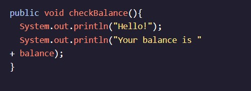

<h1>MÉTODOS</h1>

<h2>Definindo métodos</h2>

Se fôssemos definir um método para o exemplo de Conta Poupança que falamos anteriormente, ele seria o seguinte:checkBalance()

A primeira linha, , é a declaração de método. Ele dá ao programa algumas informações sobre o método:public void checkBalance()

public significa que outros Classes pode acessar esse método. Aprenderemos mais sobre isso mais adiante no curso.
A palavra-chave significa que não há voidsaída do método. Veremos Métodos que não são mais tarde nesta lição, mas por enquanto, todos os nossos métodos serão .voidvoid
checkBalance() é o nome do método.
Cada método tem sua própria assinatura de método exclusiva que é composta pelo nome do método e seu tipo de parâmetro. Neste exemplo, a assinatura do método é .checkBalance()

As duas instruções impressas estão dentro do corpo do método, que é definido pelas chaves encaracoladas: e .{}

Tudo o que podemos fazer em nosso método, podemos fazer em outros métodos! Todas as ferramentas Java que você conhece, como matemática e comparação main()Operadores, pode ser usado para fazer métodos interessantes e úteis.

Continue lendo: AP Ciência da Computação A Estudantes

checkBalance() é considerado um método não estático porque sua assinatura não inclui a palavra-chave como o método. Aprenderemos mais sobre métodos não estáticos mais adiante neste curso.staticmain()

Instruções
Checkpoint 1 Enabled
1.
Entre o construtor e o método, adicione um método chamado à classe. Ele deve ser acessível por outras classes e não deve ter saída.main()advertise()Store

Você pode deixar o corpo do método vazio.
