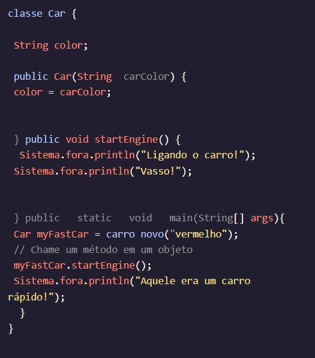

<h2>MÉTODOS</h2>

<h2>Métodos de chamada</h2>

Quando adicionamos um método não estático a uma classe, ele fica disponível para uso em um objeto dessa classe. Para que nossos métodos sejam executados, devemos Métodos o método no objeto que criamos.

Vamos adicionar um método não estático à nossa classe da lição anterior. Dentro do método, chamaremos o objeto:startEngine()Carmain()startEngine()myFastCar

Vamos dar uma olhada mais de perto na chamada do método:

Primeiro, referenciamos nosso objeto. Em seguida, usamos o operador de ponto () para chamar o método . Observe que devemos incluir parênteses após o nome do nosso método para chamá-lo.myFastCar.startEngine()()

Se executarmos o programa acima, obteremos a seguinte saída.

O código geralmente é executado em uma ordem de cima para baixo, onde a execução do código começa na parte superior de um programa e termina na parte inferior de um programa; no entanto, os métodos são ignorados pelo compilador, a menos que estejam sendo chamados.

Quando um método é chamado, o compilador executa todas as instruções contidas no método. Depois que todas as instruções do método são executadas, a ordem de execução de cima para baixo continua. É por isso que e são saídas antes .Starting the car!Vroom!That was one fast car!

Instruções
Checkpoint 1 Enabled
1.
No último exercício, definimos um novo método, mas não o vimos rodar.advertise()

Agora temos uma classe Store com definido.advertise()

Chame o método no objeto no método e veja qual é a saída!advertise()lemonadeStandmain()

2.
Agora, chame o método no objeto mais duas vezes. Ele deve ser chamado no método três vezes o total.advertise()lemonadeStandmain()

