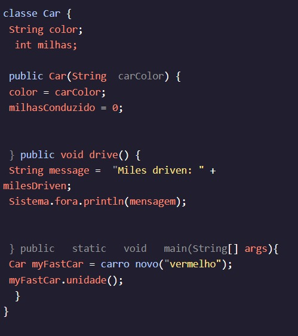

<h1>MÉTODOS</h1>

<h2>Âmbito<h2>

Um método é uma tarefa que um objeto de uma classe executa.

Marcamos o domínio desta tarefa usando chaves encaracoladas: , e . Tudo dentro dos aparelhos cacheados faz parte da tarefa. Esse domínio é chamado de escopo de um método.{}

Não podemos acessar Variáveis que são declarados dentro de um método no código que está fora do escopo desse método.

Olhando para a aula novamente:Car

A variável , que é declarada e inicializada dentro de , não pode ser usada dentro de ! Só existe no âmbito do método.messagedrivemain()drive()

No entanto, , que é declarado no topo da classe, pode ser usado dentro de todos os métodos na classe, uma vez que está no escopo de toda a classe. milesDrivenMétodos na classe, já que está no âmbito de toda a classe.

Instruções
Checkpoint 1 Passed
1.
Dentro do método, altere a variável para a variável, que é declarada no método. Isso também deve resultar na impressão:advertise()productTypecookiemain()

Vendendo biscoitos!

Certo?

Preso? Receba uma dica
Checkpoint 2 Passed
2.
Não! Recebemos um erro! A variável não pode ser acessada dentro do método anuncie. O escopo está errado! Altere-o novamente para:cookieproductType

Mensagem de cadeia de caracteres  =  "Vendendo " + productType  + "!";

Preso? Receba uma dica
Checkpoint 3 Passed
3.
Dentro do método, imprima o String , que é declarado no método. Isso deve imprimir:main()messageadvertise()

Vendendo Cookies!

Certo?

Preso? Receba uma dica
Checkpoint 4 Passed
4.
Frustrado de novo! A variável só existe dentro do escopo do método!messageadvertise()

Exclua a instrução de impressão defeituosa do método.main()

