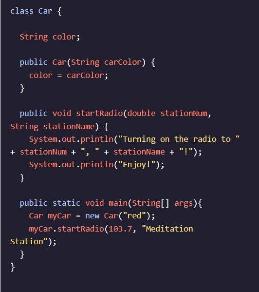
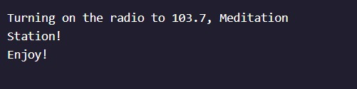
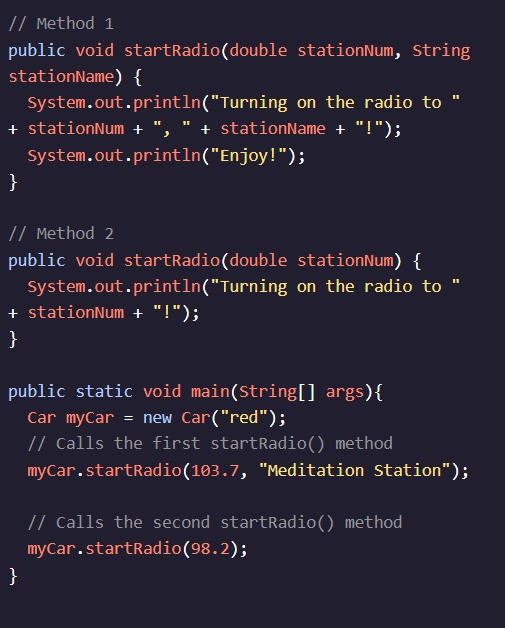

<h1>MÉTODOS</h1>

<h2>Adicionando parâmetros</h2>

Vimos como o escopo de um método nos impede de usar Variáveis declarado em um método em outro método. E se tivéssemos alguma informação em um método que precisássemos passar para outro método?

Semelhante a como adicionamos parâmetros a Construtores, podemos personalizar todos os outros Métodos para aceitar parâmetros. Por exemplo, no código a seguir, criamos um método que aceita um parâmetro, e um parâmetro chamado :startRadio()doublestationNumStringstationName

A adição de valores de parâmetro afeta a assinatura do nosso método. Como assinaturas de construtor, a assinatura do método inclui o nome do método, bem como os tipos de parâmetro do método. A assinatura do método acima é .startRadio(double, String)

No método, chamamos o método no objeto e fornecemos um argumento de e argumento de , resultando na seguinte saída:main()startRadio()myCardouble103.7String"Meditation Station",

Observe que quando chamamos um método com vários parâmetros, os argumentos fornecidos na chamada devem ser colocados na mesma ordem em que os parâmetros aparecem na assinatura. Se os tipos de argumento não corresponderem aos tipos de parâmetro, receberemos um erro.

Continue lendo: AP Ciência da Computação A Estudantes

Através da sobrecarga de métodos, nossos programas Java podem conter vários métodos com o mesmo nome, desde que a lista de parâmetros de cada método seja exclusiva. Por exemplo, podemos recriar nosso programa acima para conter dois métodos:startRadio()

Instruções
Checkpoint 1 Passed
1.
Adicione um método à classe Store chamado . Ele deve ser acessível por outras classes e não retornar nenhuma saída. Por enquanto, não tome parâmetros e deixe o corpo do método vazio.greetCustomer()

Preso? Receba uma dica
Checkpoint 2 Passed
2.
Modifique o método para que ele aceite um parâmetro chamado .greetCustomer()Stringcustomer

Preso? Receba uma dica
Checkpoint 3 Passed
3.
Dentro do método, adicione uma instrução de impressão para imprimir:greetCustomer()

"Bem-vindo à loja,  " + cliente + "!"

Preso? Receba uma dica
Checkpoint 4 Passed
4.
Dentro do método, chame o método no objeto. Passe em um argumento de sua escolha!main()greetCustomer()lemonadeStandString

