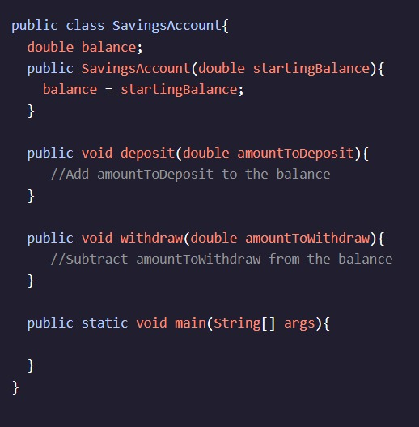
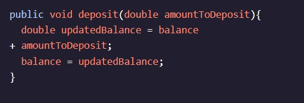
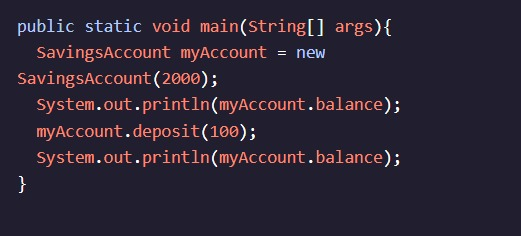

<h1>MÉTODOS</h1>

<h2>Reatribuindo campos de instância</h2>

Anteriormente, pensamos em uma Conta Poupança como um tipo de objeto que poderíamos representar em Java.

Dois dos Métodos Precisamos estão depositando e retirando:

Esses métodos alterariam o valor da variável . Podemos reatribuir o saldo para ser um novo valor usando nosso operador de atribuição, novamente.balance=

Agora, quando chamamos , ele deve alterar o valor do campo de instância :deposit()balance

Esse código primeiro imprime , o valor inicial de , e depois imprime , que é o valor de depois que o método foi executado.2000myAccount.balance2100myAccount.balancedeposit()

Alterar campos de instância é como alteramos o estado de um objeto e tornamos nossos objetos mais flexíveis e realistas.

Instruções
Checkpoint 1 Passed
1.
Adicionamos um campo de instância à classe Store. price

No entanto, para combater os custos da inflação, nos vimos aumentando o preço do nosso produto repetidamente. Adicionamos um método vazio à classe Store. É preciso um parâmetro.increasePrice()doublepriceToAdd

Dentro do método, crie uma variável chamada . Declare-o como sendo um , e defina-o igual ao mais o .increasePrice()newPricedoublepricepriceToAdd

Preso? Receba uma dica
Checkpoint 2 Passed
2.
Dentro do , defina o campo de instância como !increasePrice()pricenewPrice

Preso? Receba uma dica
Checkpoint 3 Passed
3.
No método, aumente o preço na limonada stand by . Então, imprima o para ver como ele mudou!main()1.5lemonadeStand.price
