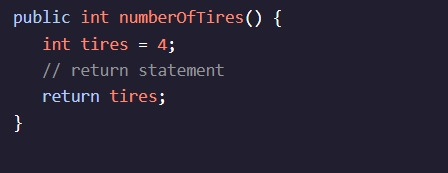
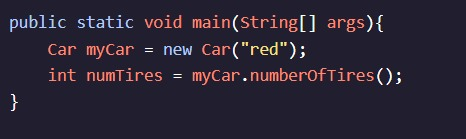
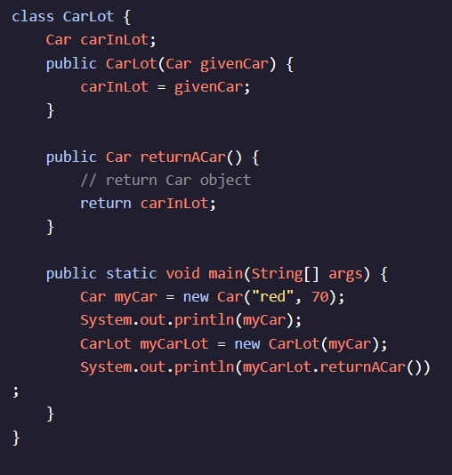

<h1>APRENDA JAVA: MÉTODOS</h1>

<h2>Retorna</h2>

Lembrar Variáveis só podem existir no âmbito em que foram declarados. Podemos usar um valor fora do método em que ele foi criado se o retornarmos do método.

Retornamos um valor usando a palavra-chave :return

Esse método, chamado , retorna . Uma vez que a instrução return é executada, o numberOfTires()4compilador sai da função. Qualquer código que exista após a instrução return em uma função é ignorado.

Em exercícios passados, ao criar novos Métodos, utilizou-se a palavra-chave . Aqui, estamos substituindo por , para significar que o tipo de retorno é um . voidvoidintint

A palavra-chave void (que significa "completamente vazio") indica que nenhum valor é retornado após chamar esse método.

Um método não-void, como retorna um valor quando ele é chamado. Podemos usar palavras-chave de tipo de dados (como , , etc.) para especificar o tipo de valor que o método deve retornar. O tipo do valor de retorno deve corresponder ao tipo de retorno do método. Se a expressão return for compatível com o tipo de retorno, uma cópia desse valor será retornada em um processo conhecido como retorno por valor.numberOfTires()intchar

Ao contrário dos métodos void, os métodos non-void podem ser usados como um valor variável ou como parte de uma expressão assim:

Dentro , chamamos o método de . Como o método retorna um valor de , armazenamos o valor em uma variável inteira chamada . Se imprimíssemos, veríamos.main()numberOfTires()myCarint4numTiresnumTires4

Continue lendo: AP Ciência da Computação A Estudantes

Aprendemos como retornar valores primitivos de um método, mas e se quiséssemos que nosso método retornasse um objeto? O retorno de um objeto funciona de forma um pouco diferente do retorno de um valor primitivo. Quando retornamos um valor primitivo, uma cópia do valor é retornada; No entanto, quando retornamos um objeto, retornamos uma referência ao objeto em vez de uma cópia dele.

Vamos criar uma segunda classe, , que usa um como parâmetro e contém um método que retorna um objeto.carLotCarCar

Esse código gera o mesmo endereço de memória porque e tem o mesmo valor de referência:myCarcarInLot

Instruções
Checkpoint 1 Passed
1.
Queremos ter um método que devolva o preço mais imposto.

Defina um método chamado que se destina a retornar o preço mais o imposto. Ele não deve tomar nenhum parâmetro e retornar um arquivo .getPriceWithTax()double

Você pode deixar o corpo do método vazio por enquanto. Nota: o código terá um erro até que retornemos o tipo correto do método, o que faremos na próxima etapa.

Preso? Receba uma dica
Checkpoint 2 Passed
2.
Dentro do método, crie uma variável igual a . é o imposto aplicado ao preço.getPriceWithTax()doubletotalPriceprice + price * 0.080.08

Depois, retorne.totalPrice

Preso? Receba uma dica
Checkpoint 3 Passed
3.
Dentro do , defina uma variável para o valor retornado por .main()doublelemonadePricelemonadeStand.getPriceWithTax()

Preso? Receba uma dica
Checkpoint 4 Passed
4.
Agora, imprima.lemonadePrice

