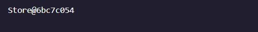
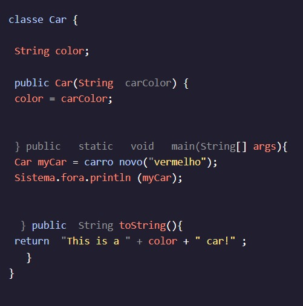

<h1>APRENDA JAVA: MÉTODOS</h1>

<h2>O método toString()</h2>

Quando imprimimos Objetos, geralmente vemos uma String que não é muito útil para determinar o que o Object representa. Na última lição, vimos que, quando imprimíamos nossos objetos, veríamos saídas como:Storesaída gostar:

onde é o nome do objeto e é sua posição na memória.Store6bc7c054

Isso não nos diz nada sobre quais são as vendas, o preço ou os outros campos de instância que definimos. Podemos adicionar um método às nossas aulas que torna essa impressão mais descritiva.StoreClasses o que torna essa impressão mais descritiva.

Quando definimos um método toString() para uma classe, podemos retornar um que será impresso quando imprimirmos o objeto:String

Quando isso for executado, o comando será impresso , que nos informa sobre o objeto .System.out.println(myCar)This is a red car!myCar

Instruções
Checkpoint 1 Passed
1.
No método, imprima os objetos e . Essas impressões são úteis para entender esses Objetos?main()lemonadeStandcookieShop

Preso? Receba uma dica
Checkpoint 2 Passed
2.
Crie um método para a classe. A assinatura do método deve dizer que é , e que retorna um arquivo . Não deve levar em nenhum parâmetro. Por enquanto, que ele devolva o .toString()StorepublicStringString"Store"

Preso? Receba uma dica
Checkpoint 3 Passed
3.
"Store" não é muito útil! Que tipo de loja é essa?

Altere o para retornar um que descreve esse objeto. toString()StringStore

O seu deve ficar assim:String

Esta loja vende productType a um preço de preço.

onde e são os valores nesses campos de instância. Por exemplo, se fosse uma loja de chapéus onde os chapéus custam 8, o diria:productTypepriceString

Esta loja vende chapéus a um preço de 8.

Preso? Receba uma dica
Checkpoint 4 Passed
4.
Veja os impressos novamente. Eles são mais úteis agora?

