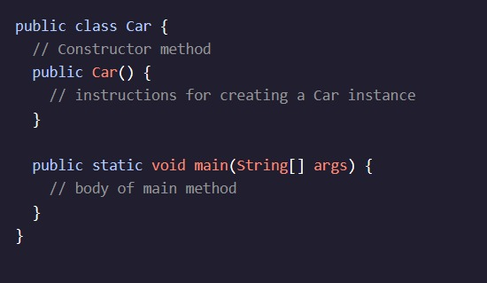
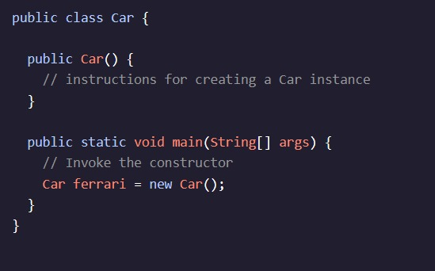
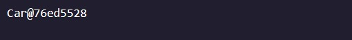
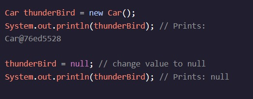

<h1>Introdução às classes</h1>

<h2>Construtores de classes</h2>

O conceito fundamental de programação orientada a objetos é a classe.

Uma é o conjunto de instruções que descrevem como uma instância pode se comportar e quais informações ela contém.

Aqui está uma definição de uma classe Java:

Este exemplo define a classO nome Car- A . (í a , , , , , ínte , . publicé um modificador de nível de acesso que permite que classes interajam com esta classe. Por enquanto, todas as aulas serão - A . (í a , , , , , ínte , .

Esta classe tem a main()método, que lista as tarefas executadas pelo programa. main()executa quando executamos o arquivo compilado.

Se nós íamos paraO valor de

Continue lendo: AP Ciência da Computação A Estudantes

Podemos inicializar uma variável do tipo de referência sem atribuir-lhe uma referência se utilizarmos o valor especial null- A . (í a , , , , , ínte , . Algo que é nullNão tem valor; se atribuímos nulla um objeto, teria uma referência vazia.

Por exemplo, no seguinte trecho de código, criaremos uma instância de Car, atribuir-lhe uma referência, e depois mudar o seu valor para null:

É importante notar que, se usarmos um nullreferência para chamar um método ou acessar uma variável de instância, nós receberemos um Erro.
Instruções de Utilização
Checkpoint 1 Passed

1.

Vamos explorar como a execução de código se move em torno do arquivo com dois métodos.

Adicione uma declaração de impressão dentro do nosso Storeconstrutor com a mensagem: I am inside the constructor method.

Veremos esta mensagem sempre que criarmos uma instância de Storechamando o construtor.
Checkpoint 2 é passado

2.

Nós não vimos nossa mensagem de construtor impressa porque não executamos o código dentro do construtor.

Por dentro main(), criar um exemplo de Store- Chamado lemonadeStand- A . (í a , , , Não se esqueça do newpalavra-chave!

Devemos ver a mensagem do construtor.
Ponto de verificação 3 é passado

3.

Por dentro main(), impressão de impressão lemonadeStandpara ver como o Java representa esta instância.

Reveja a ordem das mensagens impressas:

    Executar o programa invoca main()
    Criamos uma instância para que possamos se mover a partir de main()para Store()
    O código dentro Store()corridas
    Quando Store()termina a execução, voltamos returna main()

