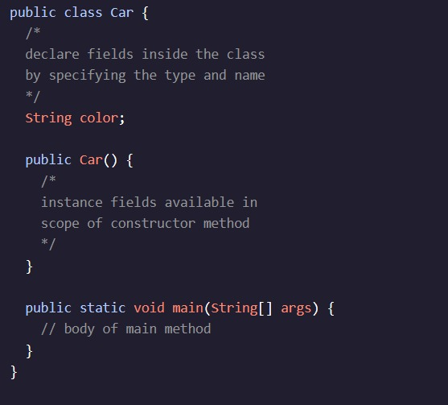

<h1>Introdução às classes</h2>

<h2>Campos de instâncias</h2

Para criar um objeto (uma instância de uma classe), precisamos de um método . O construtor é definido dentro da classe.

Vamos dar uma olhada no classe com um construtor. O construtor, , compartilha o mesmo nome que a classe:

Vamos adicionar dados a um objeto através da introdução de variáveis de instância, ou campos de instância.

Para criar uma instância, precisamos ou o construtor dentro de nós. - A . (í a , , , , , í , . O exemplo a seguir atribui a CarA instância para a variável ferrari:

Neste exemplo, em vez de ser declarado com um tipo de dados primitivo como ou a , a nossa variável é declarado como um de . Isso significa que o valor da nossa variável é uma referência ao endereço de memória de uma instância. Durante a sua declaração, o nome da classe é usado como o tipo da variável. Neste caso, o tipo é - A . (í a , , , , , í , .

Após o operador de atribuição, (=), invocamos o método do construtor: Car(), e usar a palavra-chave newpara indicar que estamos criando uma instância.
Instruções de Utilização
Checkpoint 1 Passed

1.

Adicione algum estado ao nosso Storede classe.

Declarar a StringCampo de instância para productType( , . e. . (

