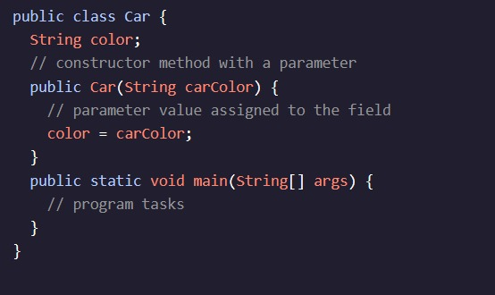
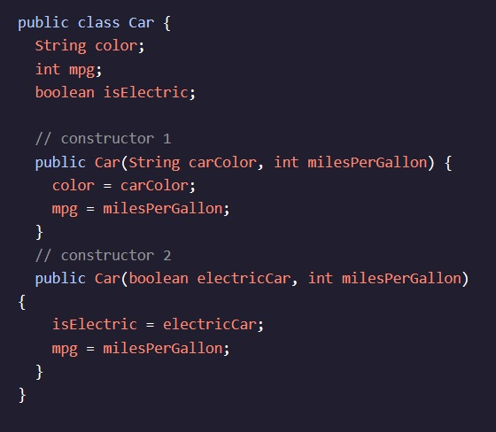
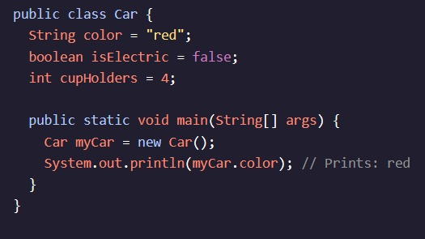

<h1>Introdução às classes</h1>

<h2>Classes: Parâmetros do Construtor</h2>

Para criar objetos com estados individuais dinâmicos, usaremos uma combinação dos campos de método e instância do construtor., que parecia algo como - A . (í a , , , , , í , . E a primeira parte, , refere-se à classe, e a segunda parte Refere-se à localização da instância na memória do computador.

Para atribuir um valor a uma variável de instância, precisamos alterar nosso método de construtor para incluir parâmetros para que ele possa acessar os dados que desejamos atribuir a uma instância. é composto de dados associados que representam as características de um objeto.

Já vimos um parâmetro noMétodo:, mas esta é a primeira vez que estamos usando o valor do parâmetro dentro de um corpo de método.

O que éCarO construtor agora tem um parâmetro:String color:“has-a” - A . (í a questão: es. , , , í , , . Outra maneira de pensar nisso é que as variáveis de instância são os substantivos e adjetivos associados a um objeto. Quais outras qualidades além de Pode um carro?

Quando um valor de corda é passado para, é atribuído ao parâmetro

Nosso método também temque define o nome e os parâmetros do método. No exemplo acima, a assinatura écolor( , . e, etc. É tarefa do construtor dar a esses campos de instância o valor inicial. Vamos aprender como fazer isso no próximo exercício.

No próximo exercício, vamos aprender como passar valores em um método!

Continue lendo: AP Ciência da Computação A Estudantes

Existem dois tipos de parâmetros: formal e real. Um parâmetro formal especifica o tipo e o nome dos dados que podem ser passados para um método. Em nosso exemplo acima, String carColoré um parâmetro formal; carColorvai representar o que StringO valor é passado para o construtor. Vamos aprender sobre os parâmetros reais no próximo exercício.

Em Java, devido à sobrecarga, uma classe pode ter múltiplosconstrutoresdesde que tenham diferentes valores de parâmetros. A assinatura é útil na medida em que ajuda o

No exemplo acima, existem dois construtores. Quando inicializamos um objeto, o compilador saberá qual construtor usar por causa dos valores que passamos nele. Por exemplo, Car myCar = new Car(true, 40)será criado pelo segundo construtor porque os argumentos correspondem ao tipo e ordem da assinatura do segundo construtor.

Se não definirmos um construtor, o compilador Java irá gerar um construtor padrão que não contém argumentos e atribui os valores padrão do objeto. Os valores padrão podem ser criados atribuindo valores aos campos de instância durante a declaração:

instruções ao desafio 
Adicione o StringParâmetro productpara o Store()O construtor.
Checkpoint 2 é passado

2.

Dentro do método do construtor, defina a variável de instância productTypeigual ao productUm parâmetro.

