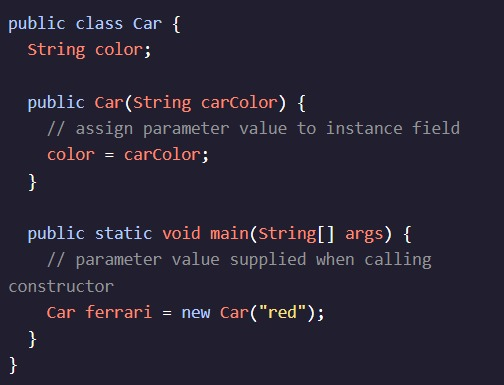
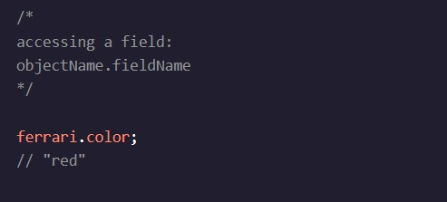

<h1>INTRODUÇÃO ÀS CLASSES</h1>

<h2>Atribuindo valores a campos de instância</h2>

Agora que nosso construtor tem um parâmetro, devemos passar valores para a chamada de método. Esses valores são chamados de argumentos; Depois de passados, eles serão usados para dar o valor inicial aos campos de instância.

Aqui criamos uma instância, , no método com como seu campo:ferrarimain()"red"color

Passamos o valor String para nossa chamada de método do construtor: . "red"new Car("red");

O tipo do valor dado à invocação deve corresponder ao tipo declarado pelo parâmetro.

Dentro do construtor, o parâmetro refere-se ao valor passado durante a invocação: . Esse valor é atribuído ao campo de instância .carColor"red"color

color já foi declarado, portanto, não especificamos o tipo durante a atribuição.

O objeto, , contém o estado de como um campo de instância que faz referência ao valor . ferraricolor"red"

Acessamos o valor deste campo com o operador dot ():.

Continue lendo: AP Ciência da Computação A Estudantes

Um parâmetro real, ou argumento, refere-se ao valor que está sendo passado durante uma chamada de método.

Chamar por valor é o processo de chamar um método com um valor de argumento. Quando um argumento é passado, o parâmetro formal é inicializado com uma cópia do valor do argumento. Por exemplo, quando declaramos o objeto, o valor é passado como um argumento; Em seguida, o parâmetro formal recebe uma cópia desse valor.ferrariString"red"carColor

Instruções
Checkpoint 1 Passed
1.
Dentro do , crie uma instância de e atribua-a à variável . Use como o valor do parâmetro.main()StorelemonadeStand"lemonade"

Preso? Receba uma dica
Checkpoint 2 Passed
2.
Imprima o campo de instância de .productTypelemonadeStand

