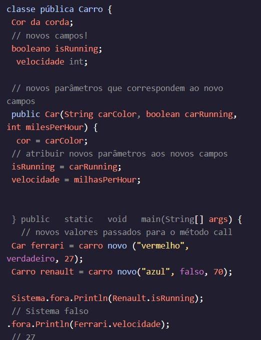
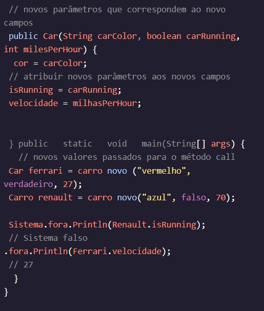
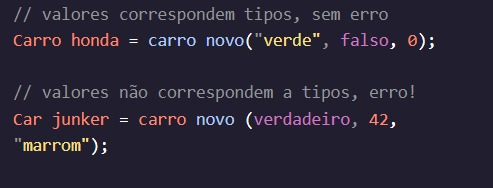

<h1>INTRODUÇÃO ÀS CLASSES</h1>

<h2>Vários campos</h2>

Os objetos não estão limitados a um único campo de instância. Podemos declarar quantos campos forem necessários para os requisitos do nosso programa.

Vamos alterar as instâncias para que elas tenham vários campos.Car

Vamos adicionar um , que indica que o motor do carro está ligado e um , que indica a velocidade em que o carro está viajando.boolean isRunningint velocity

O construtor agora tem vários parâmetros para receber valores para os novos campos. Ainda especificamos o tipo, bem como o nome para cada parâmetro.

Encomendar importa! Devemos passar valores para a invocação do construtor na mesma ordem em que eles estão listados nos parâmetros.

Instruções
Checkpoint 1 Passed
1.
Adicione dois novos campos de instância para o . Store

inventoryCount do tipo . do tipo .intinventoryPricedouble

Preso? Receba uma dica
Checkpoint 2 Passed
2.
Atualize o método do construtor com os novos parâmetros.Store

Os parâmetros devem ser , e , nessa ordem.productcountprice

Você deve usar essa ordem e incluir os tipos para cada parâmetro.

Por exemplo, é do tipo porque esse valor é atribuído ao campo de instância .productStringString productType

Preso? Receba uma dica
Checkpoint 3 Passed
3.
No corpo do construtor, atribua os valores de parâmetro aos campos de instância apropriados.Store

Preso? Receba uma dica
Checkpoint 4 Passed
4.
Dentro do , crie uma instância de chamada . main()StorecookieShop

cookieShop tem como produto. "cookies"

cookieShop tem cookies para vender e cada cookie custa .123.75

