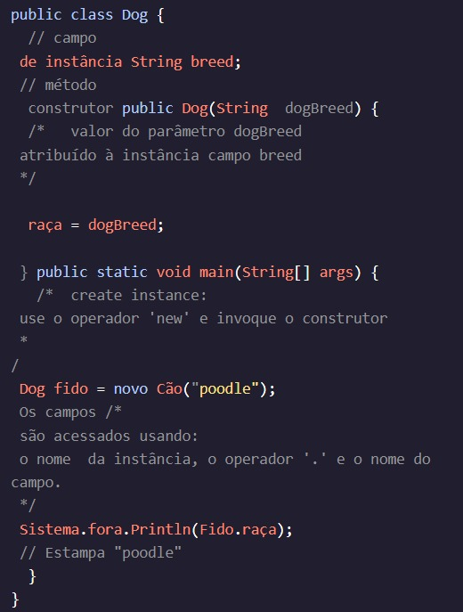

<h1>INTRODUÇÃO ÀS CLASSES</h1>

<h2>Revisão</h2>

Java é uma linguagem de programação orientada a objetos onde cada programa tem pelo menos uma classe. Os programas são muitas vezes construídos a partir de muitos Classes e objetos, que são as instâncias de uma classe.

As classes definem o estado e o comportamento de suas instâncias. O comportamento vem de Métodos definido na classe. O estado vem de campos de instância declarados dentro da classe.

As aulas são modeladas nas coisas do mundo real que queremos representar em nosso programa. Mais tarde, exploraremos como um programa pode ser feito a partir de várias classes. Por enquanto, nossos programas são uma única turma.

Instruções
O editor de texto contém uma classe. Brinque com o código!Dog

Tente adicionar e remover campos de instância. Crie instâncias com valores diferentes. Acesse e imprima diferentes campos
