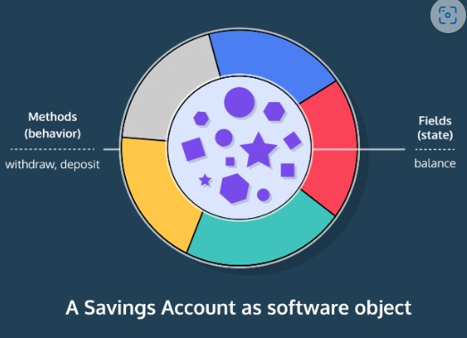

<h1>MÉTODOS</h1>

<h2>Introdução</h2>

Na última lição, aprendemos que os objetos têm estado e comportamento. Vimos como dar estado a objetos por meio de campos de instância. Agora, vamos aprender como criar o comportamento do objeto usando Métodos. Lembre-se do nosso exemplo de Conta Poupança.

O Estado nos diz o que uma caderneta de poupança deve saber:

O saldo de dinheiro disponível
O comportamento nos diz quais tarefas uma conta poupança deve ser capaz de executar:

Depósito - aumentando o valor disponível
Retirada - diminuindo a quantidade disponível
Verificação do saldo - exibindo o valor disponível.
Os métodos são blocos de código modulares e repetíveis usados para realizar tarefas específicas. Temos a capacidade de definir nossos próprios métodos que receberão entrada, farão algo com ela e retornarão o tipo de saída que queremos.

Olhando para o exemplo acima, recriar uma conta poupança não é tarefa fácil. Como um programa pode resolver um problema tão grande? É aqui que os métodos com sua capacidade de realizar tarefas menores e específicas são úteis. Através da decomposição de métodos, podemos usar métodos para dividir um grande problema em problemas menores e mais gerenciáveis.

Os métodos também são reutilizáveis. Imagine que escrevemos um programa de fabricação de sanduíches que usava 20 linhas de código para fazer um único sanduíche. Nosso programa se tornaria muito longo muito rapidamente se estivéssemos fazendo vários sanduíches. Ao criar um método, podemos fazer um sanduíche a qualquer momento simplesmente chamando-o.makeSandwich()

makeSandwich() adiciona ingredientes para fazer um sanduíche
Nesta lição, aprenderemos a criar e chamar nossos próprios métodos dentro de nossos programas.

Continue lendo: AP Ciência da Computação A Estudantes

Se fôssemos compartilhar esse programa de fazer sanduíches com outra pessoa, eles não precisariam entender como funcionava. Se escrevêssemos bem o nosso programa, tudo o que eles precisariam saber é que, se ligassem, receberiam um sanduíche. Esse conceito é conhecido como abstração processual: saber o que um método faz, mas não como ele o realiza.makeSandwich()makeSandwich()

Instruções
Checkpoint 1 Enabled
1.
Nós fizemos uma classe SavingsAccount sem usar nenhum método além e o construtor, .main()SavingsAccount()

Execute o código para ver algum comportamento da conta acontecer.

Veja o método principal! É tão longo! Há tanto código repetido! Você pode imaginar o quão bagunçado seria se você precisasse fazer 10 depósitos?

Ao longo desta lição, aprenderemos como fazer métodos que fariam a verificação do saldo, depósito e retirada de todo o comportamento que levaria apenas uma linha de código.
