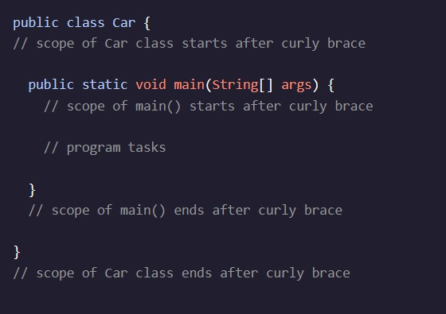

<h1>Introdução às classes<h1>

<h2>Sintaxe de Insímula</h2>

O conceito fundamental de programação orientada a objetos é a classe.

Uma classe é o conjunto de instruções que descrevem como uma instância pode se comportar e quais informações ela contém.

Java tem classes pré-definidas, como System, que usamos no registro de texto para a nossa tela, mas também precisamos escrever nossas próprias classes para as necessidades personalizadas de um programa.

Aqui está uma definição de uma classe Java:

Este exemplo define a classO nome Car- A . (í a , , , , , ínte , . publicé um modificador de nível de acesso que permite que outras classes interajam com esta classe. Por enquanto, todas as aulas serão public- A . (í a , , , , , ínte , .

Esta classe tem a main()método, que lista as tarefas executadas pelo programa. main()executa quando executamos o arquivo Car.class compilado.

Instruções de Utilização
Checkpoint 1 Passed

1.

No editor de código, crie um publicStorede classe.
Checkpoint 2 é passado

2.

Seu programa não compilará sem um main()método.

Definir um dentro Store- A . (í a ,

