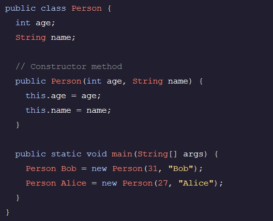

<h1>Aula 3</h1>

Estado e comportamento dos objetos Java
Em Java, as instâncias de uma classe são conhecidas como objetos. Cada objeto tem estado e comportamento na forma de campos de instância e métodos, respectivamente.

Istância Java
Instâncias Java são objetos baseados em classes. Por exemplo, pode ser uma instância da classe . BobPerson

Cada instância tem acesso ao seu próprio conjunto de variáveis que são conhecidas como campos de instância, que são variáveis declaradas dentro do escopo da instância. Os valores dos campos de exemplo são atribuídos dentro do método do construtor

Notação de ponto Java
Na linguagem de programação Java, usamos para acessar as variáveis e métodos de um objeto ou uma Classe..

Isso é conhecido como notação de ponto e a estrutura se parece com isto-

instanceOrClassName.fieldOrMethodName

Método Construtor em Java
As classes Java contêm um método de construtor que é usado para criar instâncias da classe.

O construtor é nomeado após a classe. Se nenhum construtor for definido, um construtor vazio padrão será usado.

Criando uma nova instância de classe em Java
Em Java, usamos a palavra-chave seguida de uma chamada para o construtor de classe para criar uma nova instância de uma classe.new

O construtor pode ser usado para fornecer valores iniciais para campos de instância.

Tipos de dados de referência
Uma variável com um tipo de dados de referência tem um valor que faz referência ao endereço de memória de uma instância. Durante a declaração de variável, o nome da classe é usado como o tipo da variável.

Assinaturas do construtor
Uma classe pode conter vários construtores, desde que eles tenham valores de parâmetro diferentes. Uma assinatura ajuda o compilador a diferenciar entre os diferentes construtores.

Uma assinatura é composta pelo nome do construtor e uma lista de seus parâmetros.

Valores nulos
null é um valor especial que indica que um objeto tem uma referência void.

O corpo de um método Java
Em Java, usamos colchetes para delimitar o corpo de um método.{}

As instruções escritas dentro do são executadas quando um método é chamado.{}

Parâmetros do método em Java
Em java, os parâmetros são declarados em uma definição de método. Os parâmetros atuam como variáveis dentro do método e mantêm o valor que foi passado. Eles podem ser usados dentro de um método para fins de impressão ou cálculo.

No exemplo, a e b são dois parâmetros que, quando o método é chamado, mantêm o valor 10 e 20, respectivamente.

Variáveis Java dentro de um método
As variáveis Java definidas dentro de um método não podem ser usadas fora do escopo desse método.

Retornando informações de um método Java
Um método Java pode retornar qualquer valor que possa ser salvo em uma variável. O valor retornado deve corresponder ao tipo de retorno especificado na assinatura do método.

O valor é retornado usando a palavra-chave.return

Declarando um método
As declarações de método devem definir as seguintes informações de método: escopo (privado ou público), tipo de retorno, nome do método e quaisquer parâmetros recebidos.

