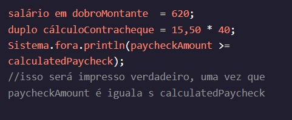

<h1>MANIPULANDO VARIÁVEIS</h1>

<h2>maior/menor ou igual a</h2>

Como poderíamos ter certeza de que recebemos pelo menos o valor que esperávamos em nosso contracheque? Poderíamos usar maior ou igual a, >=, ou menor ou igual a, <=.

Instruções
Checkpoint 1 Passed
1.
Você tem tentado completar um desafio de 30 dias para beber bastante água por dia.

Crie uma variável chamada e defina-a para o produto da ingestão de água recomendada () e a quantidade de dias no desafio ().doubletotalRecommendedAmountrecommendedWaterIntakedaysInChallenge

Preso? Receba uma dica
Checkpoint 2 Passed
2.
Crie uma variável chamada e defina-a para o resultado de verificar se a sua ingestão, , é pelo menos tanto quanto o . booleanisChallengeCompleteyourWaterIntaketotalRecommendedAmount

Em seguida, imprima a variável.isChallengeComplet
