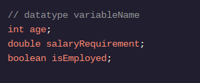
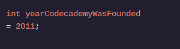

<h1>APRENDA JAVA: VARIÁVEIS</h1>

<h2>Introdução</h2>

Digamos que precisamos de um programa que conecte um usuário a novos empregos. Precisamos do nome do usuário, seu salário e sua situação profissional. Todas essas informações são armazenadas em nosso programa.

Armazenamos informações em variáveis , denominadas locais na memória.

Nomear uma informação nos permite usar esse nome posteriormente, acessando as informações que armazenamos.

As variáveis ​​também fornecem contexto e significado aos dados que armazenamos. O valor 42pode ser a idade de alguém, o peso em libras ou o número de pedidos feitos. Com um nome, sabemos que o valor 42é age, weightInPoundsou numOrdersPlaced.

Em Java, especificamos o tipo de informação que armazenamos. Tipos de dados primitivos são tipos de dados integrados ao sistema Java. Os três principais tipos primitivos que abordaremos são int, double, e boolean; esta lição apresentará esses tipos integrados e muito mais.

Devemos declarar uma variável para referenciá-la em nosso programa. Declarar uma variável requer que especifiquemos o tipo e o nome:

Os nomes das variáveis ​​acima são age, salaryRequirement, e isEmployed.

Essas variáveis ​​não possuem nenhum valor associado. Para atribuir um valor a uma variável, usamos o operador de atribuição =: 

Agora, agetem um valor de 85. Quando o código é usado para representar um valor fixo, como 85, ele é chamado de literal .

Também é comum declarar uma variável e atribuir-lhe um valor em uma linha!

Por exemplo, para atribuir 2011a uma variável chamada yearCodecademyWasFoundedtipo int, escrevemos:

<h1>Instruções</h1>

Ponto de verificação 1 ativado
1 .
Em Creator.java , definimos algumas variáveis ​​relacionadas a James Gosling, o criador do Java.

Dentro main(), use System.out.println()para imprimir a variável name.
