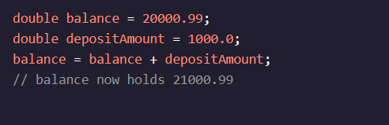
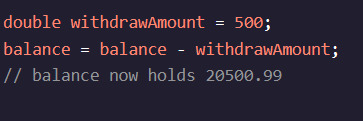
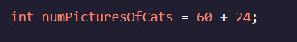
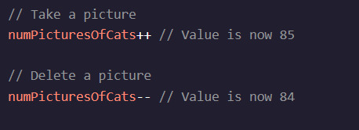

<h1>Variáveis de manipulação</h1>

<h2>Adição e subtração</h2>

Digamos que estamos escrevendo um programa que representa a conta bancária de um usuário. Com variáveis, sabemos como armazenar um saldo! Nós usaríamos a double, o tipo primitivo que pode conter grandes números decimais. Mas como depositar e retirar-nos da conta?

Por exemplo, o Java possui operações aritméticas internas que realizam cálculos em valores numéricos:

Na linha final do código acima, usamos a expressão balance + depositAmountpara determinar o novo valor do balancevariável. Quando uma expressão é executada, ela produz um único valor.

O tipo de dados de uma expressão é determinado pelo valor resultante. Por exemplo, uma expressão que usa dois intOs valores serão avaliados a um int- O valor. Se uma expressão contém a doublevalor, então o valor resultante também será do tipo double- A . (í a , , , , , í , 

instruções de desafio
[13:27, 05/02/2024] Aline Melo: 1.

Criar um intA variável chamada animalsInZooque contém a quantidade de zebras mais a quantidade de girafas no zoológico.

Em seguida, imprima o seu animalsInZoovariável.
[13:28, 05/02/2024] Aline Melo: 2.

Duas das zebras foram trocadas para um zoológico rival vizinho. Subtraia 2 do número de zebras e armazene o resultado em uma variável chamada numZebrasAfterTrade- A . (í a , , , , , í , .

Em seguida, imprima o numZebrasAfterTradevariável!

