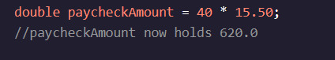
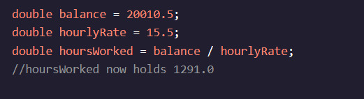
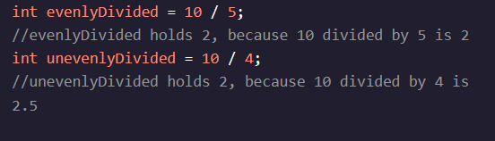

<h1>Variáveis de manipulação</h1>

<h2>A multiplicação e a divisão</h2>

Em nossa conta bancária exemplo do último exercício, usamos o +Operador para adicionar os valores E a :

Se quiséssemos retirar-nos do equilíbrio, usaríamos o -O operador

Adição e trabalho de subtração com intOs valores de tipo também! Se nós tivéssemos fotos de gatos em nosso telefone, e nós tiramos mais, poderíamos usar a seguinte linha de código para armazenar De dentro de um A que a - A , a - A , a - a que sobre a - a que sobre - A . (í a , , , , , í , .

[13:50, 05/02/2024] Aline Melo: E se tirêssemos uma foto adicional do nosso gato? Podemos refletir essa mudança usando um operador de incremento - A . (í a , , , , , í , . Quando nós anexamos para uma variável baseada numérica, aumenta o valor em - A . (í a , , , , , í , . Nós também temos o decréscimo, , o que diminui o valor em - A . (í a , , , , , í , .

É importante notar que, se tentarmos dividir qualquer número por 0, nós vamos ter um O erro como resultado.
Instruções de Utilização
Ponto de verificação 1 Ativado

Instruções do desafio 1.

In ala (em (em) - Alo) main()Existe uma variável chamada subtotal, que representa o subtotal de um montante a pagar em uma conta, e uma variável chamada tax, que representa a taxa de imposto que será aplicada a esse subtotal.

Criar um doublevariável, total, que se mantém subtotalMais o produto de subtotalE a tax( , . e. . (

Imprima o totalvariável!
[13:52, 05/02/2024] Aline Melo: 2.

There were 4 people who bought this meal together and want to split the cost.

Create a double variable called perPerson that holds total divided by 4.

Print the perPerson variable!
