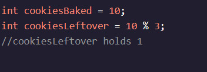
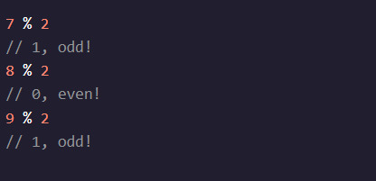

<h1>Variáveis de manipulação</h1>

<h2>Modulo</h2>

Se assarmos 10 biscoitos e dermos-nos em lotes de 3, quantos teríamos sobrando depois de dar todos os lotes completos que pudéssemos?

O operador do módulo %, dá-nos o restante depois que dois números são divididos.

Você tem 1 biscoito sobrando depois de dar todos os lotes de 3 que você poderia!

Modulo pode ser um conceito complicado, então vamos tentar outro exemplo.

Imagine que precisamos saber se um número é par ou estranho. Um número uniforme é divisível por 2.

O Modulo pode ajudar! Dividir um número uniforme por 2 terá um restante de 0. Dividir um número ímpar por 2 terá um restante de 1.

nstruções do desafio 1.

Você está tentando dividir os alunos em grupos de 3. Quantos alunos serão deixados de fora quando os grupos forem feitos?

Criar uma variável chamada leftOutque contém o módulo de studentse 3. Então, imprima a variável!
