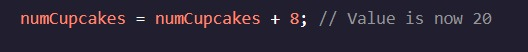

<h1>MANIPULANDO VARIÁVEIS</h1>

<h2>Operadores de atribuição composta</h2>

Às vezes, precisamos ajustar o valor de uma variável.

Imagine que estamos trabalhando em uma venda de bolos e queremos acompanhar quantos cupcakes temos, criando uma variável chamada :numCupcakes 

Se fizéssemos mais cupcakes, sabemos que poderíamos atualizar nossa variável usando o operador:8+ 

Embora esse método funcione muito bem, tivemos que escrever nossa variável duas vezes. Podemos encurtar essa sintaxe usando um operador de atribuição composto. numCupcakes

Atribuição composta Operadores executar uma operação aritmética em uma variável e, em seguida, reatribuir seu valor. Usando o operador de atribuição composta, podemos reescrever nosso código anterior assim:+= 

Agora só precisamos referenciar uma vez. numCupcakes

Podemos usar operadores de atribuição compostos para todos os operadores aritméticos que cobrimos:

Adição (+=)
Subtração (-=)
A multiplicação (*=)
Divisão (/=)
Módulo (%=)
Instruções
Checkpoint 1 Enabled
1.
Você também é responsável por manter o controle de quantos biscoitos existem na venda de bolos. Esse valor é representado pela variável .numCookies

Um cliente vem e compra cookies. Use o operador de atribuição composto apropriado para refletir essa alteração.3

2.
Outro cliente compra metade dos cookies restantes.

Use o operador de atribuição composto apropriado para refletir essa alteração.
