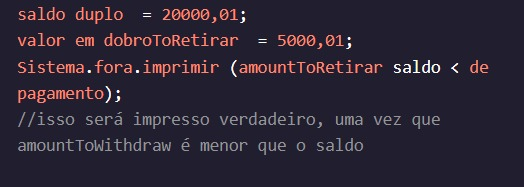
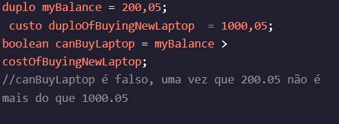

<h1>MANIPULANDO VARIÁVEIS</h1>

<h2>Maior que e menor que</h2>

Agora, estamos retirando dinheiro do nosso programa de conta bancária e queremos ver se estamos retirando menos dinheiro do que o que temos disponível.

Java tem operadores relacionais para tipos de dados numéricos que fazem comparações. Estes incluem menos de () e maior que (), que nos ajudam a resolver nosso problema de retirada.boolean<>

Você pode salvar o resultado de uma comparação como um , sobre o qual aprendeu na última lição.boolean

Instruções
Checkpoint 1 Passed
1.
Imprima a expressão que verifica se a quantidade de créditos que você ganhou, , é maior do que o número de créditos que você precisa para se formar, .creditsEarnedcreditsToGraduate

Preso? Receba uma dica
Checkpoint 2 Passed
2.
Crie uma variável chamada que contém a quantidade de créditos ganhos após a realização de um seminário, que vale créditos. deve ser a soma de e .creditsAfterSeminarcreditsOfSeminarcreditsAfterSeminarcreditsEarnedcreditsOfSeminar

Imprima se é menor que .creditsToGraduatecreditsAfterSeminar
