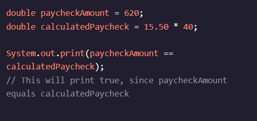
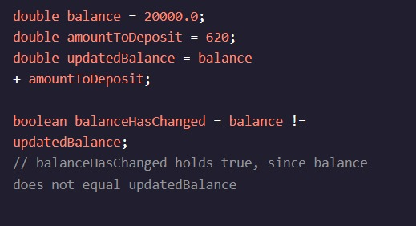

<h1>MANIPULANDO VARIÁVEIS</h1>

<h2>Igual e não igual</h2>

Então, como validaríamos nosso contracheque para ver se recebemos o valor certo?

Podemos usar outro operador relacional para fazer isso. vai nos dizer se dois ==Variáveis são iguais:

Observe que a verificação de igualdade é dois sinais iguais, em vez de um. Um sinal de igual, , é como atribuímos valores às variáveis! É fácil misturá-los, portanto, certifique-se de verificar seu código para o número certo de sinais de igual.=

Para verificar se duas variáveis não são iguais, podemos usar:!=

Instruções
Checkpoint 1 Passed
1.
Você desenterrou dois álbuns sem rótulo, o disco A e o disco B.

Para ver se são o mesmo álbum, você vai comparar o número de músicas em cada um e a duração total dos álbuns.

Primeiro, crie uma variável chamada que armazena se os dois álbuns têm o mesmo número de músicas.sameNumberOfSongs

Preso? Receba uma dica
Checkpoint 2 Passed
2.
Agora, crie uma variável chamada que armazena o resultado de verificar se os dois comprimentos de álbum não são iguais.differentLength
