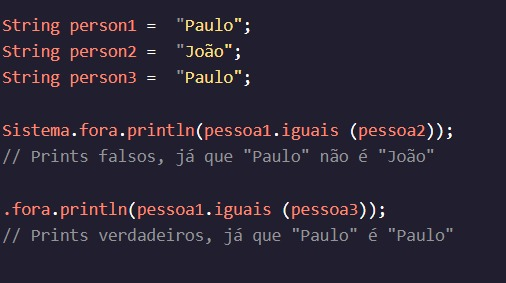

<h1>MANIPULANDO VARIÁVEIS</h1>

<h2>.igual()</h2>

Como poderíamos ter certeza de que recebemos pelo menos o valor que esperávamos em nosso contracheque? Poderíamos usar maior ou igual a, ou menor ou igual a, .StringString

Com objetos, como s, não podemos usar o operador de igualdade primitivo. Para testar a igualdade com objetos, usamos um método interno chamado . Ao comparar objetos, certifique-se de sempre usar o . funcionará ocasionalmente, mas a razão pela qual às vezes funciona tem a ver com como os objetos são armazenados na memória. String.equals().equals()==

Para os propósitos desta lição (bem como boas práticas) lembre-se de usar em vez de ao comparar objetos..equals()==

Para usá-lo, nós o chamamos em um, usando , e passamos no para comparar com em parênteses:String.String

Instruções
Checkpoint 1 Passed
1.
Temos três linhas de uma música em Song.java.

Primeiro, imprima se e são iguais.line1line2

Preso? Receba uma dica
Checkpoint 2 Passed
2.
Agora, imprima se e são iguais.line2line3
