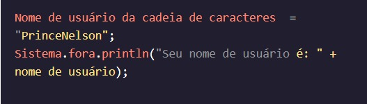
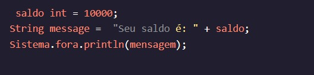

<h1>MANIPULANDO VARIÁVEIS</h1>

<h2>Concatenação de cadeia de caracteres</h2>

Nós cobrimos uma série de funcionalidades internas em Java ao longo desta lição. Já vimos , , , , e muitos outros operadores. A maioria destes só funciona em primitivos, mas alguns trabalham em s também!+-<==String

Digamos que queremos imprimir uma variável e queremos descrevê-la à medida que a imprimimos. Para o exemplo da nossa conta bancária, imagine que queremos dizer ao usuário:

Com o valor da variável exibido.username

O operador, que usamos para adicionar números, pode ser usado para concatenar s. Em outras palavras, podemos usá-lo para unir dois s!+StringString

Este código irá imprimir:

Podemos até usar um tipo de dados primitivo como a segunda variável a ser concatenada, e o Java inteligentemente o tornará um primeiro:String 

Este código irá imprimir:

Instruções
Checkpoint 1 Passed
1.
Em nosso zoológico, temos um certo número de animais, armazenados em , de uma determinada espécie, armazenados em .animalsspecies

Use para criar uma nova variável chamada . Ele deve conter uma String que se parece com:+StringzooDescription

