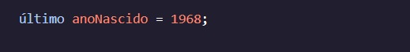
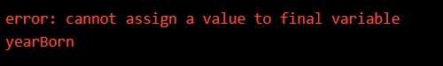

<h1> MANIPULANDO VARIÁVEIS</h1>

<h2>palavra-chave final</h2>

Ao longo desta lição, discutimos as diferentes maneiras pelas quais podemos manipular uma variável; No entanto, o que fazer com uma variável que nunca deve mudar seu valor?

Por exemplo, o ano em que nascemos permanecerá sempre o mesmo. Não tem como a gente mudar essa informação. Um valor como este em nosso código deve ser imutável.

Para declarar uma variável com um valor que não pode ser manipulado, precisamos usar a palavra-chave. Para usar a palavra-chave, preceda uma declaração de variável assim:finalfinalfinal

Quando declaramos uma variável usando , o valor não pode ser alterado; Qualquer tentativa de fazer isso causará um erro:final

Instruções
Checkpoint 1 Passed
1.
Crie uma variável imutável chamada e defina seu valor como .doublepi3.14

Imprima o valor de .pi

Preso? Receba uma dica
Checkpoint 2 Passed
2.
Em uma nova linha, tente alterar o valor de .pi

O que acontece quando o programa é executado?
