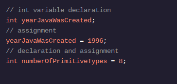

<h1>APRENDA JAVA: VARIÁVEIS</h1>

<h2>Entradas</h2>

O primeiro tipo de dado que armazenaremos é o número inteiro. Números inteiros são muito comuns em programação. Muitas vezes você os vê usados ​​para armazenar idades, tamanhos máximos ou o número de vezes que algum código foi executado, entre muitos outros usos.

Em Java, os números inteiros são armazenados no tipo de dados primitivo int .

ints contêm números positivos, números negativos e zero. Eles não armazenam frações ou números com decimais.

O inttipo de dados permite valores entre -2.147.483.648 e 2.147.483.647, inclusive.

Para declarar uma variável do tipo int, usamos a intpalavra-chave antes do nome da variável:

<h1>Instruções</h1>

Ponto de verificação 1 ativado
1 .
O arquivo CountComment.java contém vários comentários.

Mentalmente, conte o número de comentários. Então, dentro do main()método, declare uma variável chamada numCommentsque contém quantos comentários você contou.
