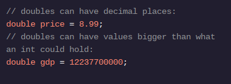

<h1>APRENDA JAVA: VARIÁVEIS</h1>

<h2>Dobra</h2>

Os números inteiros não realizam o que precisamos para todos os programas. E se quiséssemos armazenar o preço de alguma coisa? Precisamos de um ponto decimal. E se quiséssemos armazenar a população mundial? Esse número seria maior do que o inttipo pode conter.

O doubletipo de dados primitivo pode ajudar. doublepode conter decimais, bem como números muito grandes e muito pequenos. O valor máximo é 1.797.693.134.862.315,7 E+308, que é aproximadamente 17 seguido de 307 zeros. O valor mínimo é 4,9 E-324, ou seja, 324 casas decimais!

Para declarar uma variável do tipo double, usamos a doublepalavra-chave na declaração:

<h1>Instruções</h1>

Ponto de verificação 1 ativado
1 .
Em 2016, o Android detinha 81,7% da participação de mercado de sistemas operacionais móveis. Crie uma variável chamada androidShareque mantenha essa porcentagem como um dobro.
