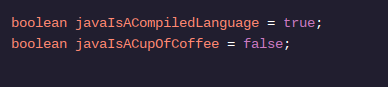

<h1>APRENDA JAVA: VARIÁVEIS</h1>

<h2>Booleano</h2>

Freqüentemente, nossos programas enfrentam questões que só podem ser respondidas com sim ou não.

O forno está ligado? A luz é verde? Eu tomei café da manhã?

Essas perguntas são respondidas com um booleano , um tipo que faz referência a um dos dois valores: trueou false.

Declaramos variáveis ​​booleanas usando a palavra-chave booleanantes do nome da variável.

Nas lições futuras, veremos como booleanos valores ajudam a orientar as decisões em nossos programas.

<h1>Instruções</h1>

Ponto de verificação 1 ativado
1 .
Crie uma variável chamada intsCanHoldDecimals. Defina-o como truese o inttipo puder conter um número decimal. Defina-o como falsese o inttipo não puder fazer isso.
