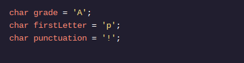

<h1>APRENDA JAVA: VARIÁVEIS</h1>

<h2>Caracteres</h2>

Como respondemos perguntas como: Que nota você tirou na prova? Com qual letra seu nome começa?

O chartipo de dados pode conter qualquer caractere, como letra, espaço ou sinal de pontuação.

Deve estar entre aspas simples, '. 

Por exemplo:

<h1>Instruções</h1>

Ponto de verificação 1 ativado
1 .
Crie uma variável chamada expectedGradedo tipo char.

Preencha-o com uma única letra, representando a nota que você acha que obteria em um curso Java graduado onde as notas A, B, e são possíveis.CDF
