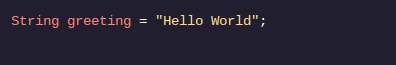
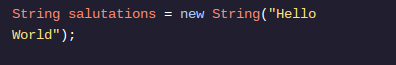
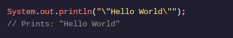
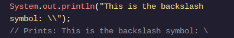
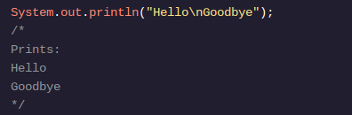

<h1>APRENDA JAVA: VARIÁVEIS</h1>

<h2>String</h2>

Até agora, aprendemos os tipos de dados primitivos , que são os tipos de dados mais simples, sem comportamento integrado. Nossos programas também usarão Strings, que são objetos , em vez de primitivos. Os objetos têm comportamento integrado.

Strings contém sequências de caracteres. Já vimos instâncias de a String, por exemplo, quando imprimimos "Hello World". Existem duas maneiras de criar um Stringobjeto: usando um Stringliteral ou chamando a Stringclasse para criar um novo Stringobjeto.

Um literal de String é qualquer sequência de caracteres entre aspas duplas ( ""). Assim como as variáveis ​​de tipo primitivo , declaramos uma Stringvariável especificando primeiro o tipo:

Também poderíamos criar um novo objeto String chamando a Stringclasse ao declarar algo Stringassim:

Existem diferenças sutis no comportamento dependendo se você cria um Stringobjeto Stringliteral ou novo String. Iremos nos aprofundar nisso mais tarde, mas por enquanto, quase sempre usaremos Stringliterais.

Continue lendo: Alunos AP de Ciência da Computação A

Certos símbolos, conhecidos como sequências de escape, têm um uso alternativo em instruções de impressão Java. As sequências de escape são interpretadas de maneira diferente pelo compilador do que outros caracteres. Os caracteres de escape começam com o caractere \.

Existem três sequências de escape que você deve conhecer no exame AP.

A \"sequência de escape nos permite adicionar aspas "a um Stringvalor. :

Se não usássemos uma sequência de escape, Java pensaria que estamos usando "para finalizar a String!

Usar a \\sequência de escape nos permite colocar barras invertidas em nosso Stringtexto:

Isto é semelhante ao último exemplo - assim como ", \geralmente tem um significado especial. Neste caso, \é usado para iniciar uma sequência de escape. Bem, se não quisermos iniciar uma sequência de escape e quisermos apenas a \em nossa String, então usaremos \\- estamos usando uma sequência de escape para dizer que não queremos \ser interpretados como o início de uma sequência de escape. sequência de fuga. É um pouco alucinante!

Finalmente, se colocarmos uma \nsequência de escape em a String, o compilador produzirá uma nova linha de texto:

Você pode pensar nisso \ncomo a sequência de escape para “nova linha”.

<h1>Instruções</h1>

Ponto de verificação 1 ativado
1 .
Crie uma variável chamada openingLyricsque tenha um valor de:"Yesterday, all my troubles seemed so far away"

