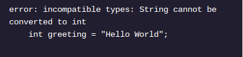

<h1>APRENDA JAVA: VARIÁVEIS</h1>

<h2>Verificação estática</h2>

A linguagem de programação Java possui tipagem estática . Os programas Java não serão compilados se uma variável receber um valor de tipo incorreto. Isto é um bug , especificamente um bug de declaração de tipo.

Insetos são perigosos! Eles fazem com que nosso código trave ou produzam resultados incorretos. A digitação estática ajuda porque os bugs são detectados durante a programação, e não durante a execução do código.

O programa não será compilado se o tipo declarado da variável não corresponder ao tipo do valor atribuído:

A String "Hello World"não pode ser mantida em uma variável do tipo int.

No exemplo acima, vemos um erro no console durante a compilação:

Quando os bugs não são detectados na compilação, eles interrompem a execução do código causando erros de execução . O programa irá falhar.

A tipagem estática do Java ajuda os programadores a evitar erros de tempo de execução e, assim, ter um código muito mais seguro e livre de bugs.

<h1>Instruções</h1>

Ponto de verificação 1 ativado
1 .
No arquivo Mess.java , declaramos várias variáveis ​​com o tipo errado. Tente compilar o arquivo usando o comando:

