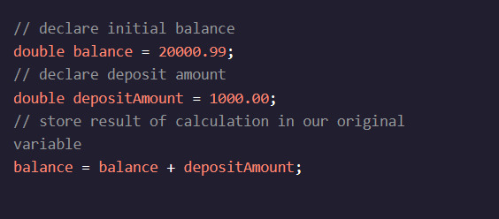

<h1>Variáveis de manipulação</h1>

<h2>Introdução</h2>

Digamos que estamos escrevendo um programa que representa a conta bancária de um usuário. Com variáveis, sabemos como armazenar um saldo! Nós usaríamos a double, o tipo primitivo que pode conter grandes números decimais. Mas como depositar e retirar-nos da conta?

Para nossa sorte, temos a capacidade de manipular o valor de nossas variáveis. Podemos usar expressões, operadores aritméticos e muito mais para alterar os valores de nossas variáveis.

Por exemplo, o Java possui operações aritméticas internas que realizam cálculos em valores numéricos:,

Na linha final do código acima, usamos a expressão balance + depositAmountpara determinar o novo valor do balancevariável. Quando uma expressão é executada, ela produz um único valor.

O tipo de dados de uma variável desempenha um papel importante nas operações que podemos usar para manipulá-la. Podemos pensar em um tipo de dados como uma combinação de um conjunto de valores e um conjunto de operações nesses valores. Por exemplo, o doubleO tipo de dados é composto de valores como 4.8e operações como adição (+) Em que o es., . Por enquanto, vamos nos concentrar principalmente no conjunto de operações que podem ser usadas em números e booleans.

O tipo de dados de uma expressão é determinado pelo valor resultante. Por exemplo, uma expressão que usa dois intOs valores serão avaliados a um int- O valor. Se uma expressão contém a doublevalor, então o valor resultante também será do tipo double- A . (í a , , , , , í , .

Ao longo desta lição, vamos aprender como manipular variáveis de diferentes tipos de dados.
Instruções de Utilização
Ponto de verificação 1 Ativado

Instruções do desafio
1.

No arquivo GuessingGame.java, definimos dois inteiros mystery1E a mystery2- A . (í a , , , , , ínte , .

Uso System.out.println()para imprimir a variável que contém um valor de 2- A . (í a , , , , , í
