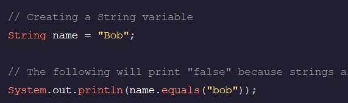
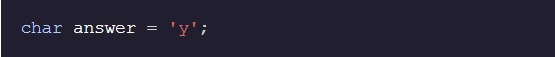
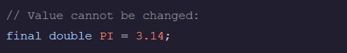
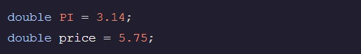
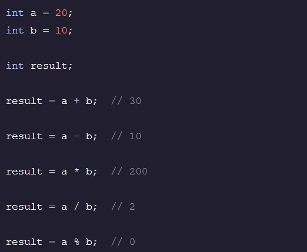
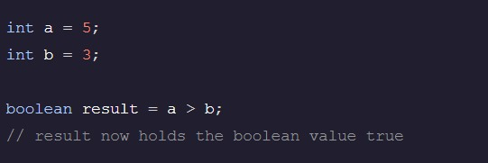
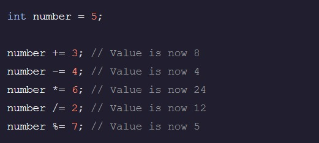

<h1>Aula 2</h2>

Fundição
A transmissão é o processo de transformação de um valor de um tipo de dados primitivo em outro.

Um valor pode ser transformado em um valor usando o operador de fundição, enquanto um valor pode ser transformado em um valor usando o operador de fundição.doubleint(int)intdouble(double)

boolean Tipo de dado
Em Java, o tipo de dados primitivo é usado para armazenar um valor, que pode ser ou .booleantruefalse

Strings
Uma String em Java é um Object que contém vários caracteres. Não é um tipo de dados primitivo.

Uma String pode ser criada colocando caracteres entre um par de aspas duplas (). "

Para comparar Strings, o método deve ser usado em vez do comparador de igualdade primitiva . equals()==

nt Tipo de dado
Em Java, o tipo de dados é usado para armazenar valores inteiros. Isso significa que ele pode armazenar todos os números inteiros positivos e negativos e zero.int

char Tipo de dado
Em Java, é usado para armazenar um único caractere. O caractere deve ser colocado entre aspas simples.char

Tipos de dados primitivos
Os tipos de dados mais básicos do Java são conhecidos como tipos de dados primitivos e estão no sistema por padrão.

Os tipos disponíveis são os seguintes:

int
char
boolean
byte
long
short
double
float
null é outra, mas só pode armazenar o valor.null

Digitação Estática
Em Java, o tipo de uma variável é verificado em tempo de compilação. Isso é conhecido como digitação estática. Ele tem a vantagem de capturar os erros em tempo de compilação em vez de em tempo de execução.

As variáveis devem ser declaradas com o tipo de dados apropriado ou o programa não será compilado.

palavra-chave final
O valor de uma variável não pode ser alterado se a variável foi declarada usando a palavra-chave.final

Observe que a variável deve receber um valor quando for declarada como . as variáveis não podem ser alteradas; Qualquer tentativa de fazer isso resultará em uma mensagem de erro.finalfinal

tipo de dados duplo
O tipo primitivo é usado para manter valores decimais.double

Operações matemáticas
As operações matemáticas básicas podem ser aplicadas ao e aos tipos de dados:intdoublefloat

+ adição
- subtração
* multiplicação
/ divisão
% modulo (produz o restante)
Essas operações não têm suporte para outros tipos de dados.

Operadores de Comparação
Os operadores de comparação podem ser usados para comparar dois valores:

> maior que
< menos de
>= maior ou igual a
<= menor ou igual a
== igual a
!= não é igual a
Eles são suportados para tipos de dados primitivos e o resultado de uma comparação é um valor booleano ou .truefalse

Operadores de atribuição composta
Os operadores de atribuição compostos podem ser usados para alterar e reatribuir o valor de uma variável usando uma linha de código. Os operadores de atribuição compostos incluem , , , e .+=-=*=/=%=

Operadores de Incremento e Decremento
O operador de incremento, (), pode aumentar o valor de uma variável baseada em número enquanto o operador de decremento, (), pode diminuir o valor de uma variável em .++1--1

Ordem das Operações
A ordem em que uma expressão com múltiplos operadores é avaliada é determinada pela ordem das operações: parênteses -> multiplicação -divisão > -> módulo -> adição -> subtração

